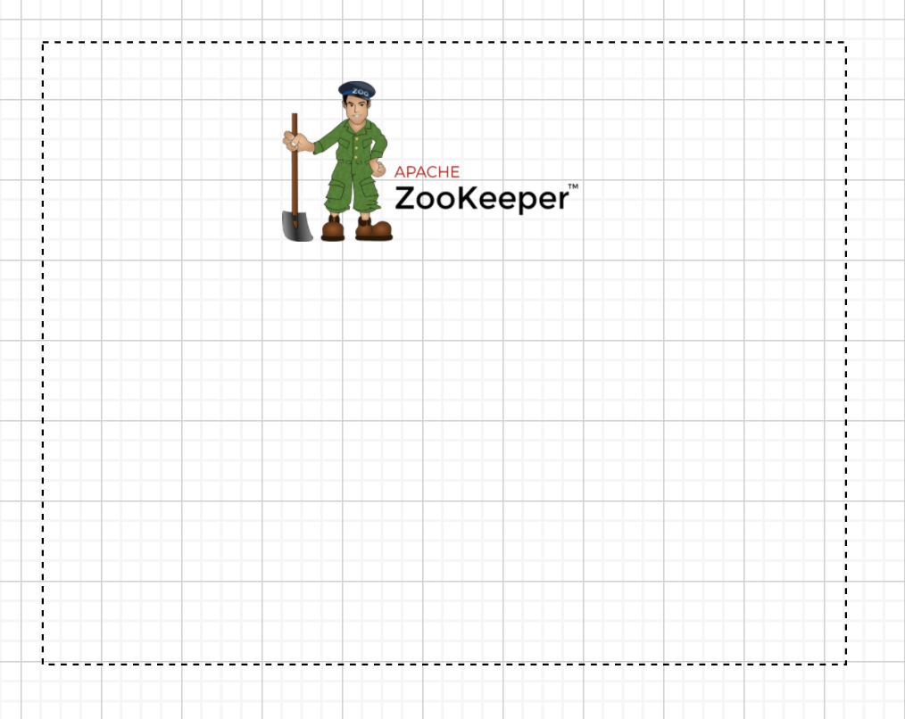
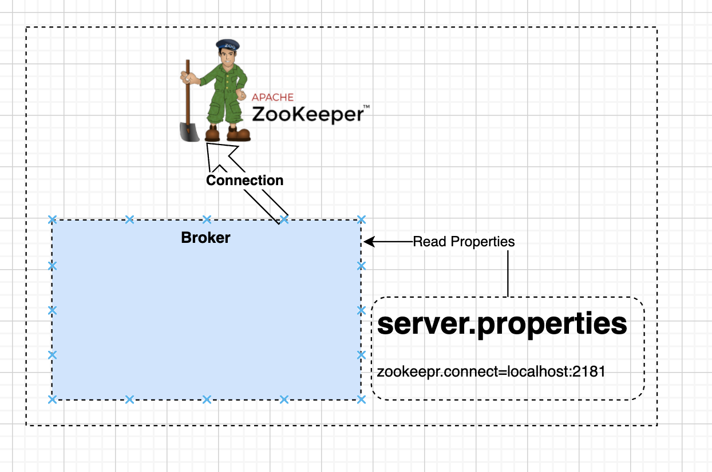
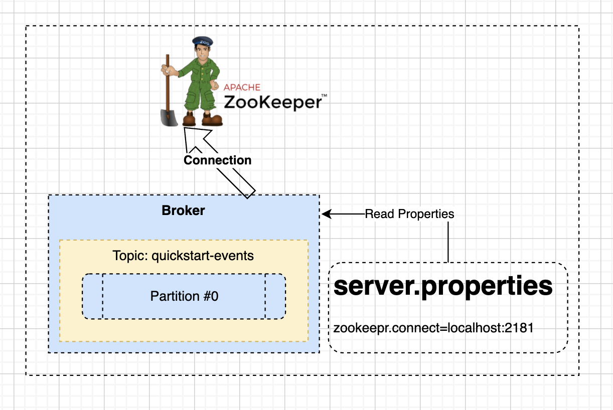
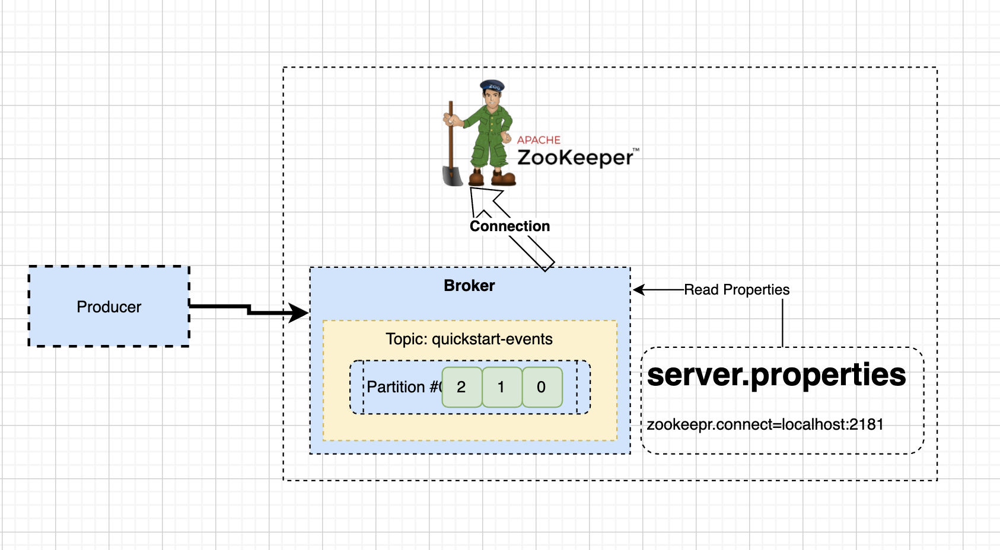
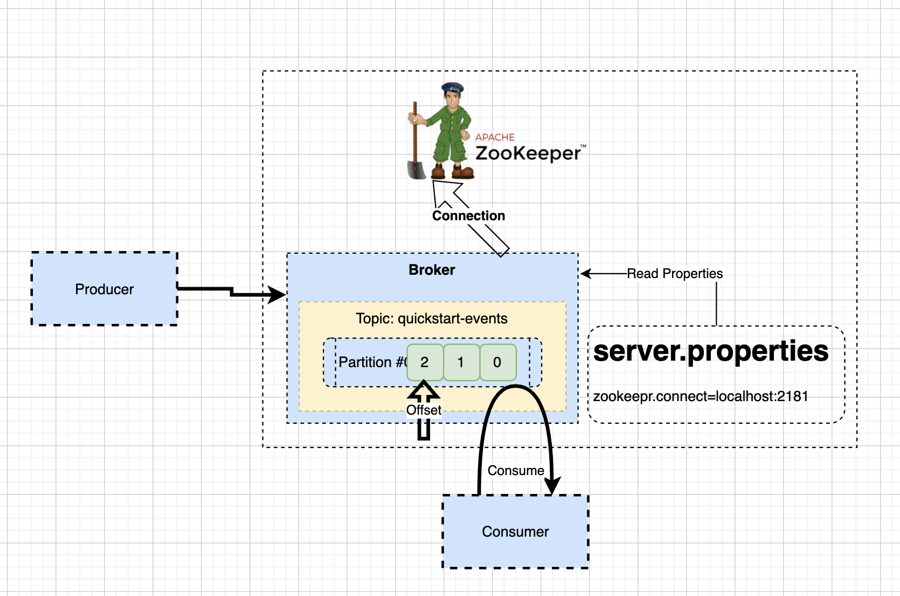

# kafka Quick Start.

- kafka를 사용하기 위해서는 공식 사이트에서 [quick start](https://kafka.apache.org/quickstart)를 찾아보면 편리하다. 
- 퀵 스타트가 있으나 개별적으로 kafka 설치를 위한 자료를 남기고 사용해 보고자 한다. 

## Kafka 다운로드 

- 우선 로컬에(Mac OS) kafka 빌드 버젼을 다운로드 받자. 
- [다운로드 사이트](https://kafka.apache.org/downloads) 에서 최신 버변을 다운로드 받는다. 
- kafka_2.13-3.1.0.tgz 를 다운받을 것이다. 

## 압축 해제하기. 

- 다운로드 된 위치에서 다음 명령어로 압축을 해제하자. 

```go
tar -xzf kafka_2.13-3.1.0.tgz 
cd kafka_2.13-3.1.0
```

## Zookeeper 기동하기. 

- kafka를 기동하기 위해서는 zookeeper를 우선 기동해야한다. 
- zookeeper는 카프카의 메타 데이터를 관리하고, kafka클러스터의 상태를 관리하는 역할을 한다. 

```go
$ bin/zookeeper-server-start.sh config/zookeeper.properties
```



- 위와 같이 zookeeper가 실행된다. 
- zookeeper는 kafka broker가 접속하기를 기다리게 된다. 

## Kafka Server 실행하기. 

- 이제 kafka 서버를 실행하자. kafka 서버는 Broker이라고 불리며, Producer와 Consumer에서 메시지 전달을 매개하는 역할을 수행한다. 

```go
$ bin/kafka-server-start.sh config/server.properties
```



- kafka-server가 실행되면, server.properties 에 존재하는 zookeeper 정보를 읽어, zookeeper에 접속한다. 

```properties
############################# Zookeeper #############################

# Zookeeper connection string (see zookeeper docs for details).
# This is a comma separated host:port pairs, each corresponding to a zk
# server. e.g. "127.0.0.1:3000,127.0.0.1:3001,127.0.0.1:3002".
# You can also append an optional chroot string to the urls to specify the
# root directory for all kafka znodes.
zookeeper.connect=localhost:2181

# Timeout in ms for connecting to zookeeper
zookeeper.connection.timeout.ms=18000
```

- 위 내용은 server.properties 에서 zookeeper 설정에 대한 부분이다. 
- 여기서 zookeeper.connect 정보가 주키퍼의 위치를 알려주게 된다. 
- 기본적으로 zookeeper는 localhost:2181 로 기동되어 있다. 

## Topic 생성하기 

- kafka를 사용하기 위해서는 Topic을 생성해야한다. 
- topic은 카테고리이다. 이는 메시지를 전달하고, 받기 위해서 만들어진 메시지 통로이다. 

### Topic 생성 

```go
$ bin/kafka-topics.sh --create --topic quickstart-events --bootstrap-server localhost:9092

Created topic quickstart-events.
```

- 토픽과 관련된 처리는 'kafka-topics.sh' 쉘을 통해 수행한다. 
- --create: 토픽을 생성하는 옵션이다. 
- --topic <topic 이름>: topic 이름을 지정할 수 있다. 여기서는 'quickstart-events'이다. 
- --bootstrap-server <broker_ip:port>: kafka 서버로 브로커의 IP와 Port를 기술한다. 참고로 broker의 기본 포트는 9092이다. 

- 우리는 위 커맨드를 통해서 'quickstart-events'라는 이름의 토픽을 생성했다. 



- 지금까지 작업으로 위 그림과 같이 토픽이 생성이 되었다. 

- topic은 broker에 유니크한 이름을 가지고 생성이 된다. 
- 하나의 브로커에는 여러 topic이 생성될 수 있다. 
- 하나의 topic에는 여러개의 partition이 생성이 될 수 있다. 
- partition은 일종의 큐라고 생각할 수 있다. 큐이므로 하나의 파티션에서는 순서가 보장된다. 
- 그러나 파티션이 여러개라면 순서보장은 되지 않음을 주의 하자. 

### 생성된 Topic 확인하기.

```go
$ bin/kafka-topics.sh --describe
 --topic quickstart-events --bootstrap-server localhost:9092

Topic: quickstart-events	TopicId: 40yg-7AVSeypQeRKXShGWg	PartitionCount: 1	ReplicationFactor: 1	Configs: segment.bytes=1073741824
	Topic: quickstart-events	Partition: 0	Leader: 0	Replicas: 0	Isr: 0
```

- 토픽과 관련된 처리는 'kafka-topics.sh' 쉘을 통해 수행한다. 
- --describe 는 토픽의 내용을 살펴볼 수 있도록 상세 내용을 기술한다. 
- --topic <topic 이름>: topic 이름을 지정할 수 있다. 여기서는 'quickstart-events'이다. 
- --bootstrap-server <broker_ip:port>: kafka 서버로 브로커의 IP와 Port를 기술한다. 참고로 broker의 기본 포트는 9092이다. 

- 결과 확인하기. 
  - Topic 이름은 'quickstart-events'이다. 
  - TopicId 는 40yg-7AVSeypQeRKXShGWg	이다. kafka 브로커에서 topic은 유니크 해야한다. 
  - PartitionCount: Topic내부에는 여러개의 파티션을 가질 수 있다. 여기서는 1개의 파티션만 있다. 
  - ReplicationFactor: 파티션에 적재되는 데이터는 이 복제 계수에 따라 복제가 된다. 보통 브로커의 개수 이하로 맞춰서 설정한다. 여기서는 1로 복제를 하지 않는다. 
  - Configs: 세그먼트 바이트를 표시하고 있다. 
  - Topic: 토픽 이름 
  - Partition: 파티션 번호 
  - Leader: 리더 번호 
  - Replicas: 복제수 
  - Isr: In Sync Replicas 로 복제대상 그룹이다. 

### 토픽에 메시지 전송하기. 

- 이제 브로커가 준비 되었고, 토픽도 생성이 되었으므로 메시지를 전송해 보자. 
- 메시지 전송을 수행하는 객체를 producer이라고 하며, kafka-console-producer.sh 를 이용하여 테스트해볼 수 있다. 

```go
$ bin/kafka-console-producer.sh --topic quickstart-events --bootstrap-server localhost:9092

>Hello there!
>I'm producer
>I send message to you
```

- kafka-console-producer.sh 쉘을 이용하여 메시지를 전송할 수 있다. 
- --topic <topic name> 으로 토픽 이름을 직접 지정해 준다. 
- --bootstrap-server <host:port> 를 지정하여 브로커에 접속한다. 
- 위와 같이 3개의 문장을 전송했다. 



- 프로듀서를 생성하고, 메시지를 전송하면 위 그림과 같은 구조가 된다. 

- 프로듀서는 브로커의 특정 토픽에 접속하게 된다. 
- 토픽에 메시지를 전송하면 파티션에 들어온 순서대로 적재가 된다. 

### 메시지 읽기 

- 이제 메시지를 읽어보자. 
- 메시지를 읽는 역할을 consumer라고 한다. kafka-console-consumer.sh 를 이용하여 메시지를 읽을 수 있다. 

```go
$ bin/kafka-console-consumer.sh --topic quickstart-events --from-beginning --bootstrap-server localhost:9092

Hello there!
I'm producer
I send message to you
```

- kafka-console-consumer.sh 쉘을 이용하여 메시지를 수신할 수 있다. 
- --topic <topic name> 으로 토픽 이름에 컨슈머가 접속하게 된다. 
- --from-beginning: 은 레코드(메시지)를 처음부터 읽겠다는 의미이다. 특정 오프셋으로 읽을 수도 있고, 최신 레코드를 읽을수 있도록 옵션이 있다. 
- --bootstrap-server <host:port> 를 지정하여 브로커에 접속한다. 

- 결과와 같이 이전에 producer에서 전송한 순새도로 메시지를 읽었다. 



- consumer를 실행하면 위 그림과 같이 컨슈머가 브로커에 접속하고, 토픽의 메시지를 순서대로 읽어가게 된다. 
- 이때 하나의 토픽그룹(나중에 알아볼 시간이 있음)이 레코드(메시지)를 읽어가면 offset이 그림과 같이 이동한다. 이렇게 해서 메시지를 어디까지 읽었는지 알 수 있다. 

## 결론 

지금까지 Kafka Quick start를 통해서 어떻게 kafka가 기동되고 동작하는지 Overview로 살펴 보았다. 

- 카프카는 주키퍼에 의해서 관리된다. 
- 브로커가 기동되면 주키퍼와 접속하고, 자신이 기동되었음을 알린다. 
- 토픽은 브로커에서 유니크한 이름으로 생성이 된다. 
- 토픽내에는 여러개의 파티션이 생성될 수 있다. 
- 개별 파티션에 적재된 메시지는 순서가 보장된다. (그러나 파티션이 여러개면 순서보장이 안된다.)
- 프로듀서는 브로커의 특정 토픽으로 메시지를 전송한다. 
- 컨슈머는 브로커의 특정 토픽의 파티션에서 메시지를 가져간다. 
- 메시지를 읽어가면 오프셋이 이동한다. 

위와 같이 Kafka의 가장 기본적인 내용을 알게 되었다. 이제 하나씩 세세하게 알아보자. 
