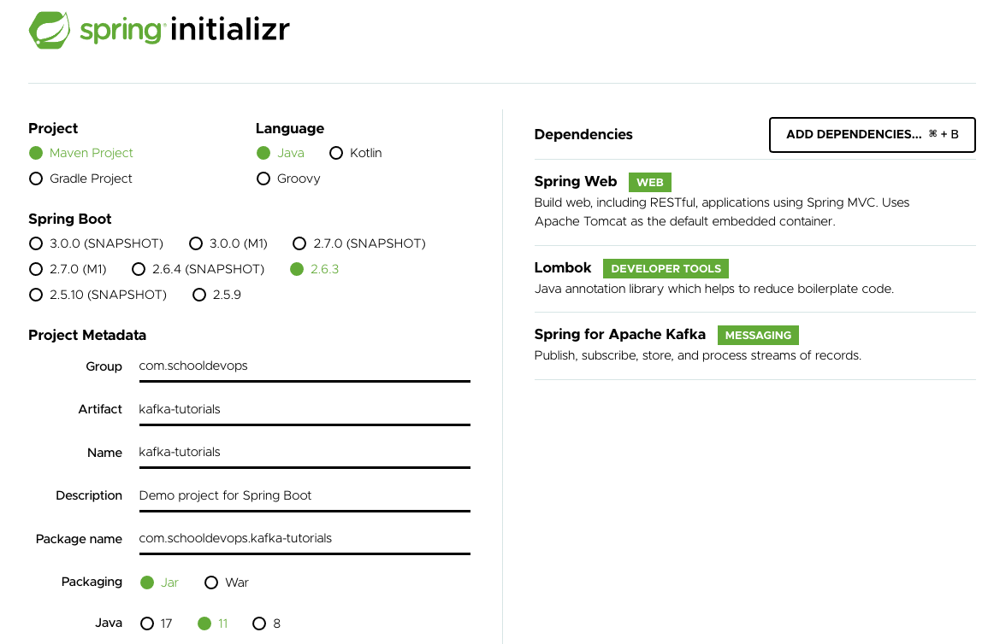

# Kafka SpringBoot Quick Start 

- 지금까지 Kafka 클러스터 구성을 하였으니 이제는 Kafka 샘플을 작성하자. 
- Kafka 샘플을 구성하고, 간단하게 메시지를 생산하고, 소비해볼 것이다. 

## 작업순서 

1. Sample Code 템플릿 생성 
2. SpringBoot Kafka 환경 설정 
3. Kafka Topic 생성 
4. Kafka Producer 생성 
5. Kafka Consumer 생성
6. Kafka 메시지 Key로 라우팅 결정하기. 

## 1. Sample Code 템플릿 새성 

- https://start.spring.io/ 에서 아래와 같이 프로젝트를 생성하자. 



- Project: Maven
- Language: Java
- Spring Boot: 2.6.3
- Project Metadata: 프로젝트 메타데이터를 화면과 같이 지정 
- Dependencies
  - Spring Web: 스프링부트 웹 모듈 추가 
  - Lombok: 보일러 플레이트 코드를 제거해주는 유용한 도구 추가 
  - Spring for Apache Kafka: 카프카를 통해 메시징 처리를 위한 모듈 

<br/>

- 위와 같이 설정한 후 "GENERATE" 버튼을 클릭하고 템플릿 코들르 다운로드 받는다. 

## Kafka 환경설정 

- 이제 우리가 생성한 Kafka Cluster에 접근하기 위해서 환경설정을 수행하자. 
- application.properties 에 다음과 같이 kafka 접속을 위한 설정을 수해한다. 

```yaml
# Kafka endpoint for endpoint
kafka.bootstrap-servers=localhost:29092,localhost:39092,localhost:49092
```

- 위 내용은 kafkaAdmin, kafka producer, kafka consumer 엔드포인트를 위한 설정이다. 
- bootstrap-servers 는 kafka 브로커를 위한 엔드포인트 경로이다. 
- docker-compose를 통해 29092, 39093, 49094 포트를 노출하도록 설계 하였다. 

## Kafka 설정을 위한 Configs 생성하기. 

- yaml 을 설정했다면 이제는 커뮤니테이션을 위한 Topic을 설정하자. 
- 어플리케이션에서 토픽을 생성하기 위해서는 KafkaAdmin 을 이용한다. 
- 토픽이 생성된 후 Producer를 위한 Config를 작성할 것이다. 

### KafkaAdmin 설정 작성하기. 

- KafkaAdmin 은 기본적으로 localhost:9092 에 접속하도록 설정이 되어 있다. 
- 그러므로 bootstrapServer로 접근할 수 있도록 다음과 같이 KafkaAdminConfig.java 파일을 만들자. 

```java
package com.schooldevops.kafkatutorials.configs;

import org.apache.kafka.clients.admin.AdminClientConfig;
import org.springframework.beans.factory.annotation.Value;
import org.springframework.context.annotation.Bean;
import org.springframework.context.annotation.Configuration;
import org.springframework.kafka.core.KafkaAdmin;

import java.util.HashMap;
import java.util.Map;

@Configuration
public class KafkaAdminConfig {

    @Value("${kafka.bootstrap-servers}")
    private String bootstrapServer;

    @Bean
    public KafkaAdmin kafkaAdmin() {
        Map<String, Object> configs = new HashMap<>();
        configs.put(AdminClientConfig.BOOTSTRAP_SERVERS_CONFIG, bootstrapServer);

        return new KafkaAdmin(configs);
    }
}

```

- 위 내용을 보면 우선 application.properties에 정의한 kafka.bootstrap-servers 의 값을 조회하고 있다. 
- KafkaAdmin을 생성할때 config를 만들고, bootstrapServers 를 지정했다. 
- AdminClientConfig.BOOTSTRAP_SERVERS_CONFIG 설정값은 bootstrap_server_config 서버를 지정해 줄 수 있다. 

### kafkaTopic 생성하기. 

- KafkaAdmin 빈을 등록하였다면 이제는 Topic을 생성할 차례이다. 
- TOPIC의 경우 필요한경우 어플리케이션에서 생성하기 위해서는 KafkaAdmin을 이용하며, 고정된 TOPIC을 이용한다면 Kafka cli 툴을 이용하여 토픽을 생성할 수 있다. 
- 우리는 여기서 어플리케이션에서 생상할 수 있도록 할 것이다. 

```java
package com.schooldevops.kafkatutorials.configs;

import org.apache.kafka.clients.admin.NewTopic;
import org.apache.kafka.common.config.TopicConfig;
import org.springframework.beans.factory.annotation.Autowired;
import org.springframework.context.annotation.Configuration;
import org.springframework.kafka.config.TopicBuilder;
import org.springframework.kafka.core.KafkaAdmin;

import javax.annotation.PostConstruct;

@Configuration
public class KafkaTopicConfig {

    public final static String DEFAULT_TOPIC = "DEF_TOPIC";

    @Autowired
    private KafkaAdmin kafkaAdmin;

    private NewTopic defaultTopic() {
        return TopicBuilder.name(DEFAULT_TOPIC)
                .partitions(2)
                .replicas(2)
                .build();
    }

    @PostConstruct
    public void init() {
        kafkaAdmin.createOrModifyTopics(defaultTopic());
    }
}

```

- 토픽 이름을 지정했다. 우리의 토픽은 DEF_TOPIC 으로 지정했음을 확인하자. 
- KafkaAdmin 빈을 이용할 것이므로 Autowired 했다. 
- NewTopic 객체를 생성하도록 함수를 하나 만들었다. 토픽 이름은 DEF_TOPIC 이며, 파티션은 2개, 복제 계수는 2개로 잡았다. 
- 우리의 kafka cluster가 3개의 브로커로 구성하였으므로 위와 같이 파티션 2개, 복제계수 2개로 지정했다. 
- @PostConstruct는 빈이 생성되고 나면 마지막으로 수행되는 어노테이션이다. 
- 이 어노테이션에서 createOrModifyTopics 메소드를 이용하여 토픽을 생성하거나, 변경하도록 한다. 


### Topic 테스트하기. 

- 이제 우리는 topic을 생성했다. 
- 이를 확인하기 위해서 다음 커맨드로 확인을 하자. multi-broker docker-compose 을 이용했다고 가장하고 다음과 같이 docker-compose.yaml 파일이 존재하는 디렉토리에서 실행해야한다. 

```go
docker-compose exec kafka-1 kafka-topics --describe DEF_TOPIC --bootstrap-server kafka-1:9092

Topic: DEF_TOPIC        TopicId: CXOleS0LScWBLSUUUODjAg PartitionCount: 2       ReplicationFactor: 2    Configs: 
        Topic: DEF_TOPIC        Partition: 0    Leader: 2       Replicas: 2,3   Isr: 2,3
        Topic: DEF_TOPIC        Partition: 1    Leader: 3       Replicas: 3,1   Isr: 3,1

```

- 커맨드 실행결과 정상적으로 파티션 2개, 복제계수 2개를 수행하고 있음을 알 수 있다. 

## Kafka Producer 설정하기 

- 토픽을 생성했다면 이제는 Producer를 작성해 보자. 
- Producer는 ProducerFactory를 이용하며, 메시지를 전송하기 위해서는 KafkaProducerTemplate 를 이용한다. 
- KafkaProducerConfig.java 파일을 생성하고 다음과 같이 추가하자. 

```java
package com.schooldevops.kafkatutorials.configs;

import org.apache.kafka.clients.producer.ProducerConfig;
import org.apache.kafka.common.serialization.StringSerializer;
import org.springframework.beans.factory.annotation.Value;
import org.springframework.context.annotation.Bean;
import org.springframework.context.annotation.Configuration;
import org.springframework.kafka.core.DefaultKafkaProducerFactory;
import org.springframework.kafka.core.KafkaTemplate;
import org.springframework.kafka.core.ProducerFactory;
import org.springframework.kafka.support.serializer.JsonSerializer;

import java.util.HashMap;
import java.util.Map;

@Configuration
public class KafkaProducerConfig {

    @Value("${kafka.bootstrap-servers}")
    private String bootstrapServer;

    private ProducerFactory<String, Object> producerFactory() {
        Map<String, Object> configProps = new HashMap<>();
        configProps.put(ProducerConfig.BOOTSTRAP_SERVERS_CONFIG, bootstrapServer);
        configProps.put(ProducerConfig.KEY_SERIALIZER_CLASS_CONFIG, StringSerializer.class);
        configProps.put(ProducerConfig.VALUE_SERIALIZER_CLASS_CONFIG, JsonSerializer.class);

        return new DefaultKafkaProducerFactory<>(configProps);
    }

    @Bean
    public KafkaTemplate<String, Object> kafkaProducerTemplate() {
        return new KafkaTemplate<>(producerFactory());
    }
}

```

- 위 내용은 bootstrapServer 를 application.properties에서 가져오도록 @Value 를 이용했다. 
- 그리고 ProducerFactory를 지정하여, 키는 String, 값은 Object 를 갖도록 팩토리를 지정했다. 
- 이후 ProducerFactory를 위한 설정값을 다음과 같이 지정한다. 
- ProducerConfig.BOOTSTRAP_SERVERS_CONFIG: kafka broker 의 엔드포인트이다. 
- ProducerConfig.KEY_SERIALIZER_CLASS_CONFIG: kafka에 전송될 키는 스트링으로 지정했다. 
- ProducerConfig.VALUE_SERIALIZER_CLASS_CONFIG: kafka에 전송될 값을 직렬화 하는 방법을 지정한다. 여기서는 JsonSerializer를 이용한다. 보통 JSON이 가장 많이 쓰인다고 볼 수 있다. 
- KafkaTemplate은 Kafka와 오퍼레이션을 수행하기 위한 편의 기능을 가진 도구이다. 우리는 여기서 producerFactory를 추가하여 kafka와 오퍼레이션을 수행할 수 있는 설정값을 전달하고 있다. 

## 메시지 객체 작성하기. 

- 우리가 kafka에 produce하고 consume할 메시지 객체를 만들자. 
- 파일이름은 TestEntity로 작성했다. TestEntity.java 를 다음과 같이 작성하자. 

```java
package com.schooldevops.kafkatutorials.entities;

import lombok.AllArgsConstructor;
import lombok.Data;
import lombok.NoArgsConstructor;

import java.time.LocalDateTime;

@Data
@NoArgsConstructor
@AllArgsConstructor
public class TestEntity {

    private String title;
    private String contents;
    private LocalDateTime time;

}
```

- 단순하게 title, contents, time 을 갖는 메시지 객체를 만들었다. 

### ProducerController 작성하기. 

- 이제는 메시지를 전송할 차례이다. 
- 메시지를 전송하기 위해서 ProducerController를 작성하자. 

```java
package com.schooldevops.kafkatutorials.controllers;

import com.schooldevops.kafkatutorials.configs.KafkaTopicConfig;
import com.schooldevops.kafkatutorials.entities.TestEntity;
import lombok.extern.slf4j.Slf4j;
import org.springframework.http.ResponseEntity;
import org.springframework.kafka.core.KafkaTemplate;
import org.springframework.kafka.support.SendResult;
import org.springframework.util.concurrent.ListenableFuture;
import org.springframework.util.concurrent.ListenableFutureCallback;
import org.springframework.web.bind.annotation.PostMapping;
import org.springframework.web.bind.annotation.RequestBody;
import org.springframework.web.bind.annotation.RequestMapping;
import org.springframework.web.bind.annotation.RestController;

import java.time.LocalDateTime;

@Slf4j
@RestController
@RequestMapping("/api")
public class ProducerController {

    // kafka producer를 위한 KafkaTemplate를 지정한다. 
    private final KafkaTemplate<String, Object> kafkaProducerTemplate;

    public ProducerController(KafkaTemplate<String, Object> kafkaProducerTemplate) {
        this.kafkaProducerTemplate = kafkaProducerTemplate;
    }

    @PostMapping("produce")
    public ResponseEntity<?> produceMessage(@RequestBody TestEntity testEntity) {
        testEntity.setTime(LocalDateTime.now());

        // kafkaProducerTemplate.send를 이용하여 메시지를 전송한다. 
        // 이때 토픽을 지정하고, 메시지를 전송하면 된다. 
        // ListenableFuture 를 이용하여 전송 결과를 확인할 수 있다. 
        ListenableFuture<SendResult<String, Object>> future = kafkaProducerTemplate.send(KafkaTopicConfig.DEFAULT_TOPIC, testEntity);

        // 메시지 처리는 비동기로 처리한다. 그러므로 callback을 지정했다. 
        future.addCallback(new ListenableFutureCallback<SendResult<String, Object>>() {
            @Override
            public void onFailure(Throwable ex) {
                log.error("Fail to send message to broker: {}", ex.getMessage());
            }

            @Override
            public void onSuccess(SendResult<String, Object> result) {
                log.info("Send message with offset: {}, partition: {}", result.getRecordMetadata().offset(), result.getRecordMetadata().partition());
            }
        });

        return ResponseEntity.ok(testEntity);

    }
}

```

- 메시지 요청을 POST로 받아서, 메시지를 kafka로 전달한다. 
- ListenableFutureCallback을 이용하여 메시지 전송후 응답이 오면 처리를 한다.
- 정상적인경우 onSuccess 메소드가 처리하고, 비정상 케이스에서는 onFailure 메소드가 처리된다. 

## Consumer 설정하기. 

- 이제 Consumer 를 설정할 차례이다. 
- 전송된 메시지를 수신할 수 있도록 ConsumerConfig를 지정하면 된다. 
- 설정을 위해서 KafkaConsumerConfig.java 파일을 다음과 같이 작성하자. 

```java
package com.schooldevops.kafkatutorials.configs;

import com.fasterxml.jackson.databind.annotation.JsonDeserialize;
import org.apache.kafka.clients.consumer.Consumer;
import org.apache.kafka.clients.consumer.ConsumerConfig;
import org.apache.kafka.common.serialization.StringDeserializer;
import org.springframework.beans.factory.annotation.Value;
import org.springframework.context.annotation.Bean;
import org.springframework.context.annotation.Configuration;
import org.springframework.kafka.annotation.EnableKafka;
import org.springframework.kafka.config.ConcurrentKafkaListenerContainerFactory;
import org.springframework.kafka.core.ConsumerFactory;
import org.springframework.kafka.core.DefaultKafkaConsumerFactory;
import org.springframework.kafka.support.serializer.JsonDeserializer;

import java.util.HashMap;
import java.util.Map;

@EnableKafka
@Configuration
public class KafakConsumerConfig {

    @Value("${kafka.bootstrap-servers}")
    private String bootstrapServer;

    private ConsumerFactory<String, Object> consumerFactory(String groupId) {
        Map<String, Object> props = new HashMap<>();

        props.put(ConsumerConfig.BOOTSTRAP_SERVERS_CONFIG, bootstrapServer);
        props.put(ConsumerConfig.GROUP_ID_CONFIG, groupId);
        props.put(ConsumerConfig.ISOLATION_LEVEL_CONFIG, "read_committed");

        JsonDeserializer<Object> jsonDeserializer = new JsonDeserializer<>();
        // Deserialize에 대해서 신뢰하는 패키지를 지정한다. "*"를 지정하면 모두 신뢰하게 된다.
        jsonDeserializer.addTrustedPackages("*");

        return new DefaultKafkaConsumerFactory<>(props, new StringDeserializer(), jsonDeserializer);
    }

    @Bean
    public ConcurrentKafkaListenerContainerFactory<String, Object> defaultKafkaListenerContainerFactory() {
        ConcurrentKafkaListenerContainerFactory<String, Object> factory = new ConcurrentKafkaListenerContainerFactory<>();
        factory.setConsumerFactory(consumerFactory("defaultGroup"));
        factory.setConcurrency(1);
        factory.setAutoStartup(true);
        return factory;
    }
}

```

- @EnableKafka: 는 KafkaListener를 검사하는 설정이다. 이 어노테이션을 지정해야 @KafkaListener 를 활성화 된다. 
- kafka.bootstrap-servers 에 지정된 kafka cluster 엔드포인트를 조회한다. 
- ConsumerFactory 는 kafka consumer를 생성하기 위한 설정을 가지며, consumer를 생성하는 역할을 한다. 
- ConcurrentKafkaListenerContainerFactory 를 이용하여 동시에 kafka cluster로 부터 메시지를 읽을 수 있도록 지정한다. 
  - 여기서 consumerFactory를 파라미터로 전달하여, 컨슈머를 생성할 수 있도록 한다. 
  - setConcurrency 값은 동시에 읽을 컨슈머의 개수를 지정한다 여기서는 1개만 지정했다. 
  - setAutoStartup 값을 통해서 메시지 리스너가 자동으로 실행할지 지정한다. (true이므로 서버가 부트업 되면서 자동 실행된다. )

## Kafka Listener 생성하기. 

- ConsumerFactory를 작성했다면 이제는 Listener를 등록할 차례이다. 
- Listener를 등록하면 kafka cluster로 부터 메시지를 리슨할 수 있게 된다. 
- MessageListener.java 파일을 생성하여 다음과 같이 작성한다. 

```java
package com.schooldevops.kafkatutorials.consumers;

import com.schooldevops.kafkatutorials.configs.KafkaTopicConfig;
import lombok.extern.slf4j.Slf4j;
import org.springframework.kafka.annotation.KafkaListener;
import org.springframework.stereotype.Component;

@Slf4j
@Component
public class MessageListener {

    @KafkaListener(topics = KafkaTopicConfig.DEFAULT_TOPIC, containerFactory = "defaultKafkaListenerContainerFactory")
    public void listenDefaultTopic(Object record) {
        log.info("Receive Message from {}, values {}", KafkaTopicConfig.DEFAULT_TOPIC, record);

    }
}

```

- 메시지 리스너를 스프링에서 이용하기 위해서 @Component 를 지정한다. 
- @KafkaListener 를 지정한다. 이때 전달되는 파라미터는 다음과 같다. 
  - topics: 메시지를 송신/수신하기 위한 토픽을 지정한다. 
  - groupId: 컨슈머 그룹 아이디이다. 그룹에 속한 컨슈머는 할당된 파티션만 조회한다. 
  - containerFactory: 이전에 지정한 컨테이너 팩토리 이름을 지정해 준다. 우리는 KafkaConsumerConfig에서 지정한 defaultKafkaListenerContainerFactory 을 지정 하였다. 
- 메시지를 수신하면 토픽 이름과 레코드를 콘솔로 출력한다. 

## 결과 테스트하기.

- 이제 결과를 테스트해보자. 
- 서버를 다시 실행하고 메시지를 전송하면 다음과 같은 결과를 확인할 수 있다. 

```go
2022-02-21 17:57:01.796  INFO 34273 --- [ad | producer-1] c.s.k.controllers.ProducerController     : Send message with offset: 1, partition: 1
```

- 위 내용은 메시지를 송신 결과를 나타낸다. 

```go
2022-02-21 17:57:01.818  INFO 34273 --- [ntainer#0-0-C-1] c.s.k.consumers.MessageListener          : Receive Message from DEF_TOPIC, values ConsumerRecord(topic = DEF_TOPIC, partition = 1, leaderEpoch = 2, offset = 1, CreateTime = 1645433821733, serialized key size = -1, serialized value size = 80, headers = RecordHeaders(headers = [], isReadOnly = false), key = null, value = TestEntity(title=TestSend2, contents=contents, time=2022-02-21T17:57:01.699981))
```

- 메시지 리스너가 조회한 메시지를 출력했다. 
- 수신된 메시지는 DEF_TOPIC에서 조회했음을 알 수 있다. 
- values는 수신한 레코드 내용과, 파티션, 오프셋등을 확인할 수 있다. 

## WrapUp

- 지금까지 우리는 멀티 kafka broker cluster를 구성했다. 
- 그리고 java를 이용하여 메시지를 송신하고, 수신하는 예제를 작성했다. 
- 위 예제는 가장 일반적으로 사용되는 단순 메시지 생산/소비를 구성한 예제이다. 
- 이후 예제에서는 직접 메시지를 뽑아오는 방식, 그룹 아이디를 다르게 지정하여 메시지를 수신하는 방법, 메시지 우선순위 지정, 메시지 에러 핸들링, 메시지 송/수신 트랜잭션 처리하기 등에 대해서 알아 볼 것이다. 