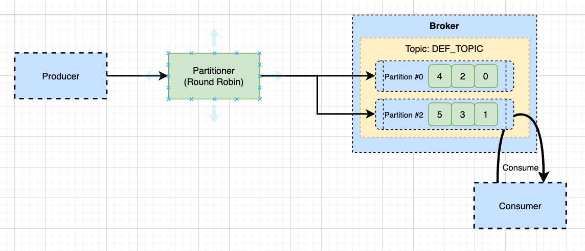
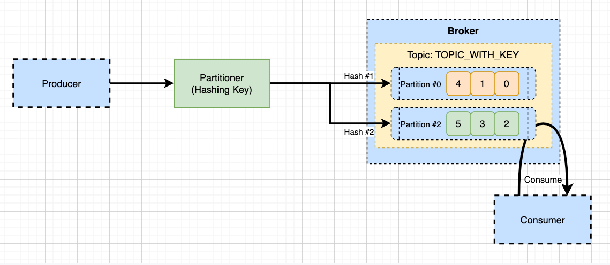

# Kafka SpringBoot Quick Start with Partition Key

- 이번에는 kafka 메시지에 key를 할당하고, 이 key에 따라 파티션이 선택되도록 해보자. 
- 기본적으로 kafka는 key가 설정되지 않은경우, 메시지는 reound robin 방식으로 파티션을 선택하여 메시지가 전달된다. 
- key가 있다면 key값을 hashing하고 해싱 결과를 이용하여 파티션을 선택하도록 하고 있다. 
- 만약 특정 메시지의 키에 따라 들어온 순서가 중요한 서비스라면, 키를 반드시 할당하고, 이들이 특정 파티션으로 분배되도록 지정해주는 용도로 사용할 수 있다. 

## 메시지 키가 없는경우 



- 메시지가 들어오면 파티셔너가 메시지 키를 확인하고 메시지를 분산한다. 
- 위와 같이 메시지 키가 없는경우 라운드로빈 방식으로 한번씩 파티션에 메시지를 할당한다. 
- 메시지 번호를 보면 한번에 하나씩 메시지가 파티션에 할당됨을 확인할 수 있다. 

## 메시지 키가 있는경우 



- 동일하게 파티셔너는 해싱을 통해서 메시지를 보낸다. 
- 위와 같이 메시지 키가 있는경우 해싱을 위한 방식으로 파티션에 메시지를 할당한다. 
- 메시지 번호가 서로 다르며, 키에 따라 들어온 순서대로 메시지가 적재 된다. 
## 기본사항 

- 기본적으로 Kafka 클러스터가 구축되어 있어야한다. 
- [Kafka SpringBoot Quick Start](./05.KafkaSpringBootSample.md) 를 참조하여 가장 기본적인 Kafka 어플리케이션을 구축하자. 

## Key 할당을 위한 설정 생성하기. 

- application.properties 에 다음과 같이 토픽을 추가한다. 

```
# 토픽 키를 이용할수 있도록 한다. 
kafka.topic-with-key=topic-key
```

## Topic 설정 코드 추가하기. 

- 이제는 신규 추가한 토픽을 이용할 수 있도록 KafkaTopicConfig.java 파일을 수정하자. 

```java
package com.schooldevops.kafkatutorials.configs;

import org.apache.kafka.clients.admin.NewTopic;
import org.apache.kafka.common.config.TopicConfig;
import org.springframework.beans.factory.annotation.Autowired;
import org.springframework.beans.factory.annotation.Value;
import org.springframework.context.annotation.Configuration;
import org.springframework.kafka.config.TopicBuilder;
import org.springframework.kafka.core.KafkaAdmin;

import javax.annotation.PostConstruct;

@Configuration
public class KafkaTopicConfig {

    public final static String DEFAULT_TOPIC = "DEF_TOPIC";

    @Value("${kafka.topic-with-key}")
    public String TOPIC_WITH_KEY;

    @Autowired
    private KafkaAdmin kafkaAdmin;

    private NewTopic defaultTopic() {
        return TopicBuilder.name(DEFAULT_TOPIC)
                .partitions(2)
                .replicas(2)
                .build();
    }

    private NewTopic topicWithKey() {
        return TopicBuilder.name(TOPIC_WITH_KEY)
                .partitions(2)
                .replicas(2)
                .build();
    }

    @PostConstruct
    public void init() {
        kafkaAdmin.createOrModifyTopics(defaultTopic());
        kafkaAdmin.createOrModifyTopics(topicWithKey());
    }
}

```

- public String TOPIC_WITH_KEY: 으로 조금전 지정한 토픽 이름을 @Value로 가져왔다. 
- NewTopic topicWithKey() 메소드를 화용하여 토픽을 신규로 생성했다. 파티션은 2개이며 복제 계수는 1로 잡았다. 
- kafkaAdmin.createOrModifyTopics(topicWithKey()); 로 어플리케이션이 기동될때 토픽이 있다면 수정하고, 없다면 새로 생성하도록 한다. 

## Listener 등록하기. 

- 토픽을 생성했다면 해당 토픽으로 메시지를 수힌할 수 있도록 Listener작업이 필요하다. 
- MessageListener.java 파일에 다음 메소드를 추가하자. 

```java
... 생략 
    @KafkaListener(topics = "${kafka.topic-with-key}", containerFactory = "defaultKafkaListenerContainerFactory")
    public void listenTopicWithKey(Object record) {
        log.info("Receive Message from {}, values {} with key", record);

    }
... 생략 
```

- KafkaListener어노테이션을 이용하여 토픽과 컨테이너를 등록했다. 
- topics는 프로퍼티에 있는 값을 그대로 읽을 수 있도록 SpEL을 지원한다. 
- containerFactory는 기본 프로그램에서 생성한 컨테이너 팩토리를 그대로 지정했다. 
- 메시지를 수신하면 단순하게 로깅하는 코드이다. 

## Key 를 할당한 Producer 작성하기. 

- 메시지에 키를 담아 전송할 수 있도록 Controller를 다음과 같이 작성하자. 
- ProcedureController.java 파일에 엔드포인트를 다음과 같이 추가하자. 

```java
...생략 
    @Value("${kafka.topic-with-key}")
    public String TOPIC_WITH_KEY;

    @PostMapping("produce-with-key/{key}")
    public ResponseEntity<?> produceMessageWithKey(@PathVariable("key") String key, @RequestBody TestEntity testEntity) {
        testEntity.setTime(LocalDateTime.now());

        ListenableFuture<SendResult<String, Object>> future = kafkaProducerTemplate.send(TOPIC_WITH_KEY, key, testEntity);

        future.addCallback(new ListenableFutureCallback<SendResult<String, Object>>() {
            @Override
            public void onFailure(Throwable ex) {
                log.error("Unable to send message: {}", ex.getMessage());
            }

            @Override
            public void onSuccess(SendResult<String, Object> result) {
                log.info("Sent message with key: {}, offset: {}, partition: {}", key, result.getRecordMetadata().offset(), result.getRecordMetadata().partition());
            }
        });

        return ResponseEntity.ok(testEntity);
    }
...생략 
```

- TOPIC_WITH_KEY: properties에 지정한 속성이다. 
- produce-with-key/{key} 로 URI를 지정했다. 
- 기본 프로그램과 차이접은 kafkaProducerTemplate.send(TOPIC_WITH_KEY, key, testEntity) 이 부분이 다르다. 
  - key: 를 전달하여 키에 의한 파티셔닝을 수행하도록 작업했다. 


### 테스트하기  

- 파티션 키 1번으로 보낸경우 
  
```
curl -X POST localhost:8080/api/produce-with-key/key1 -H "Content-Type: application/json" -d '{"title": "TestSendKey1", "contents": "contents"}'

Sent message with key: key1, offset: 1, partition: 0

Receive Message from ConsumerRecord(topic = topic-key, partition = 0, leaderEpoch = 0, offset = 1, CreateTime = 1646022629916, serialized key size = 4, serialized value size = 84, headers = RecordHeaders(headers = [], isReadOnly = false), key = key1, value = TestEntity(title=TestSendKey1, contents=contents, time=2022-02-28T13:30:29.889397)), values {} with key
```

- 파티션 키 3번으로 보낸경우 

```
curl -X POST localhost:8080/api/produce-with-key/key2 -H "Content-Type: application/json" -d '{"title": "TestSendKey2", "contents": "contents"}'

Sent message with key: key3, offset: 0, partition: 1

Receive Message from ConsumerRecord(topic = topic-key, partition = 1, leaderEpoch = 0, offset = 0, CreateTime = 1646022736311, serialized key size = 4, serialized value size = 84, headers = RecordHeaders(headers = [], isReadOnly = false), key = key3, value = TestEntity(title=TestSendKey3, contents=contents, time=2022-02-28T13:32:16.311240)), values {} with key
```

## WrapUp

- 지금가지 키를 통해서 파티션 분배를 수행해 보았다. 
- 기본적으로 Kafka는 키가 부여되면 Round Robin으로 파티션을 분배한다. 
- 키가 존재하면 키를 기주으로 해싱을 통해서 해시된 값에 따라 파티션으로 분배 된다. 
- 특정 키에 대해서 우선순위가 중요하다면 꼭 파티션 키를 이용하자. 