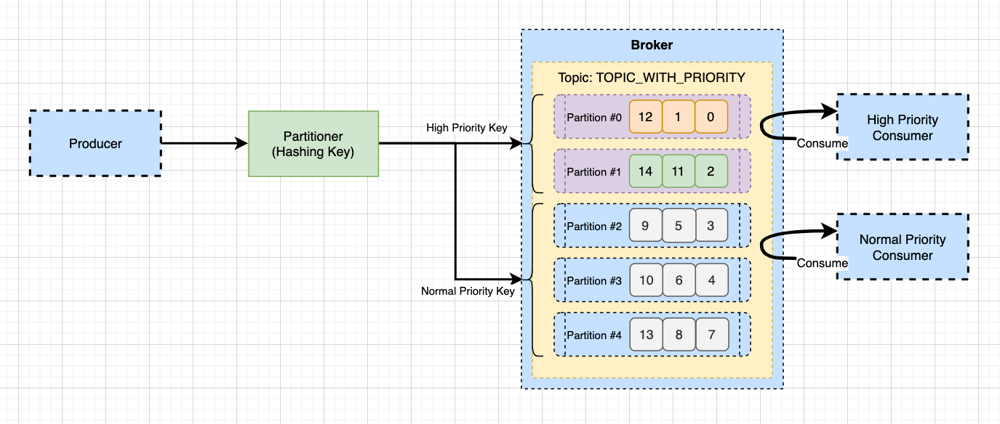

# Kafka SpringBoot Quick Start with Priority Queue

- 메시지를 프로듀싱 할때, 우선순위에 따라 별도로 메시지를 수신 받아야할 때가 있다. 
- 동일한 토픽이지만 메시지 높은 우선순위를 설정해야하는 경우, 이 메시지는 별도로 처리가 필요하다. 
- 일반 메시지는 일반 처리를 수행한다면 우리는 필요할때 우선순위 설정을 확인하고, 메시지를 빠르게 처리할 수 있을 것이다. 

## 우선순위 메시지 수신 처리방식. 

- 우선순위 메시지 수신은 키를 이용하여 파티션을 파티션 벼킷을 분리하는 방식을 이용한다. 
- 동일 토픽에서 메시지를 수신할때, 메시지 키에 따라 메시지를 필터링하여 우선 처리해야할 작업을 수행하는 방식으로 이루어진다. 



- 위 Overview에서 Producer는 메시지를 우선순위 키를 할당하여 메시지를 브로커로 전달한다. 
- 키에 따라 파티션에 메시지를 할당한다. 여기서 우선순위 파티션, 일반 순위 파티션으로 나눠지게 될 것이다. 
- 컨슈머는 각각 컨슈머 그룹을 별도로 두고, 메시지를 컨슘한다. 
- 이때 컨슈머는 필터링을 통해 우선순위 컨슈머, 일반 컨슈머들이 메시지를 처리할지 결정하고 메시지를 처리한다. 

## 기본사항 

- 기본적으로 Kafka 클러스터가 구축되어 있어야한다. 
- [Kafka SpringBoot Quick Start](./05.KafkaSpringBootSample.md) 를 참조하여 가장 기본적인 Kafka 어플리케이션을 구축하자. 

## Key 할당을 위한 설정 생성하기. 

- application.properties 에 다음과 같이 토픽을 추가한다. 

```
# 토픽 키를 이용할수 있도록 한다. 
kafka.topic-with-priority=topic-priority
```

## Topic 설정 코드 추가하기. 

- 이제는 신규 추가한 토픽을 이용할 수 있도록 KafkaTopicConfig.java 파일을 수정하자. 

```java
package com.schooldevops.kafkatutorials.configs;

import org.apache.kafka.clients.admin.NewTopic;
import org.apache.kafka.common.config.TopicConfig;
import org.springframework.beans.factory.annotation.Autowired;
import org.springframework.beans.factory.annotation.Value;
import org.springframework.context.annotation.Configuration;
import org.springframework.kafka.config.TopicBuilder;
import org.springframework.kafka.core.KafkaAdmin;

import javax.annotation.PostConstruct;

@Configuration
public class KafkaTopicConfig {

    public final static String DEFAULT_TOPIC = "DEF_TOPIC";

    @Value("${kafka.topic-with-key}")
    public String TOPIC_WITH_KEY;

    @Value("${kafka.topic-with-priority}")
    public String TOPIC_WITH_PRIORITY;

    @Autowired
    private KafkaAdmin kafkaAdmin;

    private NewTopic defaultTopic() {
        return TopicBuilder.name(DEFAULT_TOPIC)
                .partitions(2)
                .replicas(2)
                .build();
    }

    private NewTopic topicWithKey() {
        return TopicBuilder.name(TOPIC_WITH_KEY)
                .partitions(2)
                .replicas(2)
                .build();
    }

    private NewTopic topicWithPriority() {
        return TopicBuilder.name(TOPIC_WITH_PRIORITY)
                .partitions(3)
                .replicas(2)
                .build();
    }

    @PostConstruct
    public void init() {
        kafkaAdmin.createOrModifyTopics(defaultTopic());
        kafkaAdmin.createOrModifyTopics(topicWithKey());
        kafkaAdmin.createOrModifyTopics(topicWithPriority());
    }
}

```

- 우선 properties에 설정한 값을 변수로 불러온다. @Value를 이용하여 프로퍼티를 불러올 수 있다. 
- NewTopic topicWithPriority() 메소드를 통해서 파티션 3개, 복제계수 2로 토픽을 생성했다. 
- kafkaAdmin.createOrModifyTopics(topicWithPriority()) 으로 서버가 실행될때 토픽이 자동 생성되도록 한다. 

## Consumer 높은 우선순위 처리를 위한 컨슈머를 등록한다. 

- 우선 높은 우선순위 처리를 위한 컨슈머를 등록하기 위해서 ConsumerFactory를 생성한다.
- KafkaConsumerConfig.java 파일에 다음과 같이 컨슈머 빈을 등록하자. 

```java
    @Bean
    public ConcurrentKafkaListenerContainerFactory<String, Object> highPriorityKafkaListenerContainerFactory() {
        ConcurrentKafkaListenerContainerFactory<String, Object> factory = new ConcurrentKafkaListenerContainerFactory<>();
        factory.setConsumerFactory(consumerFactory("consumerGroupHighPriority"));
        factory.setRecordFilterStrategy(consumerRecord -> !"highPriority".equals(consumerRecord.key()));
        factory.setConcurrency(1);
        factory.setAutoStartup(true);
        return factory;
    }
```

- 위 코드는 highPriorityKafkaListenerContainerFactory메소드를 생성한다. 
- 여기에서 중요한 부분은 consumerFactory를 생성할때 컨슈머 그룹 이름을 "consumerGroupHighPriority" 로 설정했다. 
- 레코드가 들어오면 setRecordFilterStrategy 에 의해서 hightPriority 로 키가 없다면 필터링 처리되어서 메시지를 버리게 된다. 

## Consumer 일반 우선순위 처리를 위한 컨슈머를 등록한다. 

- 일반 우선순위 처리를 위한 컨슈머를 등록하기 위해서 ConsumerFactory를 생성한다. 
- KafkaConsumerConfig.java 파일에 다음과 같이 컨슈머 빈을 등록하자. 

```java
    @Bean
    public ConcurrentKafkaListenerContainerFactory<String, Object> normalPriorityKafkaListenerContainerFactory() {
        ConcurrentKafkaListenerContainerFactory<String, Object> factory = new ConcurrentKafkaListenerContainerFactory<>();
        factory.setConsumerFactory(consumerFactory("consumerGroupNormalPriority"));
        factory.setRecordFilterStrategy(consumerRecord -> "highPriority".equals(consumerRecord.key()));
        factory.setConcurrency(1);
        factory.setAutoStartup(true);
        return factory;
    }
```

- 위 코드는 normalPriorityKafkaListenerContainerFactory 메소드를 생성한다. 
- 여기에서 중요한 부분은 consumerFactory를 생성할때 컨슈머 그룹 이름을 "consumerGroupNormalPriority" 로 설정했다. 
- 레코드가 들어오면 setRecordFilterStrategy 에 의해서 hightPriority 로 키가 있다면 필터링 처리되어서 메시지를 버리게 된다. (즉, 현재 컨슈머에서는 일반 우선순위만 처리한다는 의미가 된다.)

## 메시지 리스너 등록하기. 

- 이제 메시지가 들어오면 적절한 메시지 리스너를 생성하자. 
- 우리가 생성한 highPriorityKafkaListenerContainerFactory메소드를, normalPriorityKafkaListenerContainerFactory 를 등록할 것이다. 
- MessageListener.java 에 다음 내용을 추기한다. 

```java
    @KafkaListener(topics = "${kafka.topic-with-priority}", containerFactory = "highPriorityKafkaListenerContainerFactory")
    public void listenPriorityTopic(Object record) {
        log.info("Received high priority message: {}", record);
    }

    @KafkaListener(topics = "${kafka.topic-with-priority}", containerFactory = "normalPriorityKafkaListenerContainerFactory")
    public void listenNonPriorityTopic(Object record) {
        log.info("Received normal priority message: {}", record);
    }
```

- 우리가 등록한 토픽을 설정했다. 
- 그리고 우선순위가 높은 토픽은 highPriorityKafkaListenerContainerFactory 컨테이너 팩토리를 등록했다. 
- 일반 우선순위인 경우 토픽은 normalPriorityKafkaListenerContainerFactory 컨테이너 팩토리를 등록했다. 

## 프로듀서 생성하기. 

- 우선순위를 지정하기 위해서 프로듀서 컨슈머를 조금 바꾸자. 
- ProducerController.java 에 다음 코드를 추가하자. 

```java
... 생략 
    @Value("${kafka.topic-with-priority}")
    public String TOPIC_WITH_PRIORITY;

... 생략 

    @PostMapping("produce-with-priority/{key}")
    public ResponseEntity<?> produceMessageWithPriority(@PathVariable("key") String key, @RequestBody TestEntity testEntity) {
        testEntity.setTime(LocalDateTime.now());

        ListenableFuture<SendResult<String, Object>> future = kafkaProducerTemplate.send(TOPIC_WITH_PRIORITY, key, testEntity);

        future.addCallback(new ListenableFutureCallback<SendResult<String, Object>>() {
            @Override
            public void onFailure(Throwable ex) {
                log.error("Unable to send message: {}", ex.getMessage());
            }

            @Override
            public void onSuccess(SendResult<String, Object> result) {
                log.info("Sent message with priority: {}, offset: {}, partition: {}", key, result.getRecordMetadata().offset(), result.getRecordMetadata().partition());
            }
        });

        return ResponseEntity.ok(testEntity);
    }
```

## 테스트하기. 

- 테스트를 하기 위해서 우리는 메시지 키를 이용하므로 ProducerController.java 에서 /api/produce-with-priority/{key} 를 이용한다. 

```go
curl -X POST localhost:8080/api/produce-with-priority/highPriority -H "Content-Type: application/json" -d '{"title": "HighPriority1", "contents": "contents HighPriority1"}'

Sent message with priority: highPriority, offset: 0, partition: 0

Received high priority message: ConsumerRecord(topic = topic-priority, partition = 0, leaderEpoch = 0, offset = 0, CreateTime = 1646029457353, serialized key size = 12, serialized value size = 99, headers = RecordHeaders(headers = [], isReadOnly = false), key = highPriority, value = TestEntity(title=HighPriority1, contents=contents highPriority1, time=2022-02-28T15:24:17.320741))
```

- 위 내용은 높은 우선순위로 메시지를 전송한 것이다. 

```go
curl -X POST localhost:8080/api/produce-with-priority/normalPriority -H "Content-Type: application/json" -d '{"title": "normalPriority1", "contents": "contents normalPriority1"}'

Sent message with priority: normalPriority, offset: 0, partition: 1

Received normal priority message: ConsumerRecord(topic = topic-priority, partition = 1, leaderEpoch = 0, offset = 0, CreateTime = 1646029472318, serialized key size = 14, serialized value size = 103, headers = RecordHeaders(headers = [], isReadOnly = false), key = normalPriority, value = TestEntity(title=normalPriority1, contents=contents normalPriority1, time=2022-02-28T15:24:32.318831))
```

- 위 내용은 일반 우선순위로 메시지를 전송한 것이다. 

## WrapUp

- 지금까지 우선순위에 따라 메시지를 프로듀스 하고, 우선순위에 따른 컨슈밍 수행을 했다. 
- 방식은 키를 통해 파티션을 분리하여 나눠진 버킷으로 메시지가 들어가게 했다. 
- 그리고 컨슈머는 서로다른 그룹을 만들어 동일한 데이터를 읽도록 했다. 그리고, 키에 따라 메시지를 필터링 했다. 