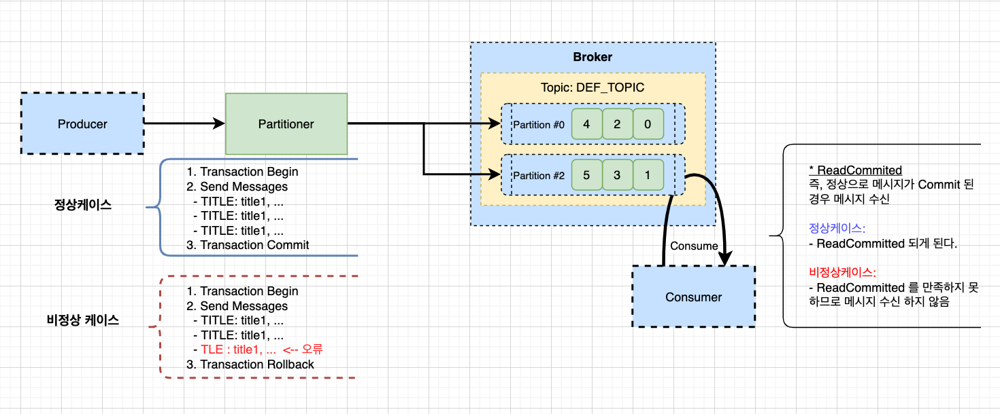

# Kafka SpringBoot Quick Start with Transaction

- kafka 는 트랜잭선 처리를 수행할 수 있다. 

## Transaction Concept 



- 정상 트랜잭션 흐름 
  - 1. 그림과 같이 여러 메시지를 동일 트랜잭션 ID 묶기 위해 트랜잭션을 시작한다. 
  - 2. 메시지를 검사하고, 정상인경우 메시지를 브로커로 전달한다. 
  - 3. 오류가 없다면 트랜잭션을 정상으로 커밋한다. 
  - 4. 메시지는 Transaction Isolation Level이 ReadCommitted 가 된다. 
  - 5. ConsumerFactory 에 설정된 Isolation Level에 따라 ReadCommitted이면 컨슘 하므로 메시지가 출력된다. 

- 비정상 트랜잭션 흐름 
  - 1. 그림과 같이 여러 메시지를 동일 트랜잭션 ID 묶기 위해 트랜잭션을 시작한다. 
  - 2. 메시지를 검사하고, 정상인경우 메시지를 브로커로 전달한다. 
  - 3. 이때 바정상 케이스가 발생하여 예외가 발생한다. 
  - 4. 예외로 인해 트랜잭션 롤백이 진행된다. 
  - 5. 메시지는 Transaction Isolation Level이 ReadCommitted 으로 처리되지 못한다. 
  - 6. ConsumerFactory 에 설정된 Isolation Level에 따라 ReadCommitted이면 컨슘 하므로 메시지를 컨슘하지 않는다. 

- 위와 같은 케이스에 따라 트랜잭션을 처리하게 된다. 

## 기본사항 

- 기본적으로 Kafka 클러스터가 구축되어 있어야한다. 
- [Kafka SpringBoot Quick Start](./05.KafkaSpringBootSample.md) 를 참조하여 가장 기본적인 Kafka 어플리케이션을 구축하자. 

## 프로퍼티 설정하기

```
# Transactional Topic
kafka.transactional-topic=transactional-topic
```

- 트랜잭션 토픽을 생성하기 위해서 위와 같이 application.properties에 설정한다. 

## 토픽 등록하기. 

- 이제 Topic을 여느때와 같이 등록하면 된다. 
- KafkaTopicConfig.java 파일을 다음과 같이 추가한다.

```
...생략
    @Value("${kafka.transactional-topic}")
    public String TOPIC_TRANSACTION;
...생략
    private NewTopic topicTransactional() {
        return TopicBuilder.name(TOPIC_TRANSACTION)
                .partitions(2)
                .replicas(2)
                .build();
    }

    @PostConstruct
    public void init() {
        ... 생략
        kafkaAdmin.createOrModifyTopics(topicTransactional());
    }

```

- 위와같이 토팩 설정을 읽어오고, 토픽을 생성한다. 
- 그리고 마지막으로 토픽을 어플리케이션이 부트업 될때 등록한다. 

## ConsumerFactory 생성하기.

- 이제 ConsumerFactory 를 생성하자.
- 이를 위해 KafkaConsumerFactory.java 파일에 다음 내용을 추가하자. 

```java
... 생략
    private ConsumerFactory<String, Object> consumerFactory(String groupId) {
        Map<String, Object> props = new HashMap<>();

        props.put(ConsumerConfig.BOOTSTRAP_SERVERS_CONFIG, bootstrapServer);
        props.put(ConsumerConfig.GROUP_ID_CONFIG, groupId);

        // 컨슈머가 메시지를 읽을때 READ_COMMITTED된 메시지만 읽도록 설정을 추가한다. 
        props.put(ConsumerConfig.ISOLATION_LEVEL_CONFIG, KafkaProperties.IsolationLevel.READ_COMMITTED.toString().toLowerCase());

        JsonDeserializer<Object> jsonDeserializer = new JsonDeserializer<>();
        // Deserialize에 대해서 신뢰하는 패키지를 지정한다. "*"를 지정하면 모두 신뢰하게 된다.
        jsonDeserializer.addTrustedPackages("*");

        return new DefaultKafkaConsumerFactory<>(props, new StringDeserializer(), jsonDeserializer);
    }

... 생략
    @Bean
    public ConcurrentKafkaListenerContainerFactory<String, Object> transactionalKafkaListenerContainerFactory() {
        ConcurrentKafkaListenerContainerFactory<String, Object> factory = new ConcurrentKafkaListenerContainerFactory<>();
        factory.setConsumerFactory(consumerFactory("consumerGroupTransactional"));
        factory.setConcurrency(1);
        factory.setAutoStartup(true);
        return factory;
    }
... 생략

```

- 중요 포인트는 다음과 같다. 
  - props.put(ConsumerConfig.ISOLATION_LEVEL_CONFIG, KafkaProperties.IsolationLevel.READ_COMMITTED.toString().toLowerCase()) 으로 설정하여 커밋된 메시지만 컨슘하겠다고 지정한다. 
  - transactionalKafkaListenerContainerFactory 메소드로 메시지 그룹을 생성하고 빈으로 등록했다. 

## Listener 등록하기. 

- 이제 메시지가 들어오면 리슨하고 있다가, 메시지를 읽어들이고 처리를 수행하는 메소드를 작성하자. 
- MessageListener.java 파일에 다음 내용을 추가한다. 

```java
    @KafkaListener(topics = "${kafka.transactional-topic}", containerFactory = "transactionalKafkaListenerContainerFactory")
    public void listenForTransactionalTopic(Object record) {
        log.info("Received Transactional message: {}", record);
    }
```

- 토픽은 kafka.transactional-topic으로 지정했다. 
- containerFactory는 조금전에 생성한 컨슈머 팩토리를 등록했다. 

## 프로듀서 설정 등록하기. 

- 이제는 우리의 어플리케이션이 메시지를 보낼때 보때 트랜젝션 메시지 여부를 설정할 것이다. 
- KafkaProducer.Config.java 파일을 열고 다음과 같이 수정한다. 

```java
package com.schooldevops.kafkatutorials.configs;

import org.apache.kafka.clients.producer.ProducerConfig;
import org.apache.kafka.common.serialization.StringSerializer;
import org.springframework.beans.factory.annotation.Value;
import org.springframework.context.annotation.Bean;
import org.springframework.context.annotation.Configuration;
import org.springframework.kafka.core.DefaultKafkaProducerFactory;
import org.springframework.kafka.core.KafkaTemplate;
import org.springframework.kafka.core.ProducerFactory;
import org.springframework.kafka.support.serializer.JsonSerializer;

import java.util.HashMap;
import java.util.Map;

@Configuration
public class KafkaProducerConfig {

    @Value("${kafka.bootstrap-servers}")
    private String bootstrapServer;

    private ProducerFactory<String, Object> producerFactory(boolean transactional) {
        Map<String, Object> configProps = new HashMap<>();
        configProps.put(ProducerConfig.BOOTSTRAP_SERVERS_CONFIG, bootstrapServer);
        configProps.put(ProducerConfig.KEY_SERIALIZER_CLASS_CONFIG, StringSerializer.class);
        configProps.put(ProducerConfig.VALUE_SERIALIZER_CLASS_CONFIG, JsonSerializer.class);

        if (transactional) {
            configProps.put(ProducerConfig.TRANSACTIONAL_ID_CONFIG, "tx");
        }

        return new DefaultKafkaProducerFactory<>(configProps);
    }

    @Bean
    public KafkaTemplate<String, Object> kafkaProducerTemplate() {
        return new KafkaTemplate<>(producerFactory(false));
    }

    @Bean
    public KafkaTemplate<String, Object> kafkaTransactionalProducerTemplate() {
        return new KafkaTemplate<>(producerFactory(true));
    }
}
```

- 중요한 포인트는 config에 ProducerConfig.TRANSACTIONAL_ID_CONFIG을 설정했고, 설정값은 tx로 잡았다. 
- 그리고 예전과 다르게 트랜잭션용 ProducerFactory를 생성할 수 있도록 옵션을 주었다. 이 부분이 kafkaTransactionalProducerTemplate 이다. 

## ProducerController 작성하기. 

- 이제는 메시지들을 한번에 보내고 이들끼리 트랝잭션으로 묶을 수 있도록 컨틀롤러를 작성할 것이다. 
- ProducerController.java 파일을 다음과 같이 수정하자. 

```java
... 생략 
    @Value("${kafka.transactional-topic}")
    public String TOPIC_TRANSACTION;

... 생략 

    @PostMapping("produce/transactional")
    public ResponseEntity<?> sendTransctional(@RequestBody List<TestEntity> testEntities) {

        List<TestEntity> entityList = new ArrayList<>();
        if (testEntities == null || testEntities.isEmpty()) {
            return ResponseEntity.status(404).body("Not Valid Request Parameters");
        }

        LocalDateTime localTime = LocalDateTime.now();
        kafkaTransactionalProducerTemplate.executeInTransaction(kafkaOperations -> {
            for (TestEntity entity: testEntities) {
                entity.setTime(localTime);

                // title 엔터티가 TITLE: 로 시작하는경우 정상진행
                if (entity.getTitle() != null && entity.getTitle().startsWith("TITLE:")) {
                    kafkaOperations.send(TOPIC_TRANSACTION, entity);
                    entityList.add(entity);

                    try {
                        Thread.sleep(500);
                    } catch (InterruptedException e) {
                        e.printStackTrace();
                    }
                } else {
                    throw new RuntimeException("Error Exception by not valid title: " + entity.getTitle());
                }
            }

            return null;
        });

        return ResponseEntity.ok(entityList);
    }
```

- 코드는 복수개의 TestEntity를 받아 들이고, 타이틀을 검사한다. 
- title로 들어온 값이 TITLE: 로 시작하는경우 정상 내용이다. 
- 만약 TITEM: 이외의 값으로 시작하는 경우에는 트랜잭션 롤백이 수행되도록 했다. 

## 테스트 수행하기. 

- 이제 테스트를 수행해 보자. 

```
curl -X POST localhost:8080/api/produce/transactional -H "Content-Type: application/json" -d '[{"title": "TITLE: testTitle1", "contents": "contents test-title-1"},{"title": "TITLE: testTitle2", "contents": "contents test-title-2"}]'

```

```
... 메시지 전송 (트랜잭션 전송 요청)
2022-03-03 16:14:46.013  INFO 9517 --- [nio-8080-exec-1] o.a.k.c.p.internals.TransactionManager   : [Producer clientId=producer-tx20, transactionalId=tx20] Invoking InitProducerId for the first time in order to acquire a producer ID
2022-03-03 16:14:46.018  INFO 9517 --- [| producer-tx20] org.apache.kafka.clients.Metadata        : [Producer clientId=producer-tx20, transactionalId=tx20] Cluster ID: XqacYcepSSuF_6ClVXgPHg
2022-03-03 16:14:46.722  INFO 9517 --- [| producer-tx20] o.a.k.c.p.internals.TransactionManager   : [Producer clientId=producer-tx20, transactionalId=tx20] Discovered transaction coordinator localhost:49092 (id: 3 rack: null)
2022-03-03 16:14:46.906  INFO 9517 --- [| producer-tx20] o.a.k.c.p.internals.TransactionManager   : [Producer clientId=producer-tx20, transactionalId=tx20] ProducerId set to 0 with epoch 0

... 메시지 수신 (트랜잭션 메시지 수신)
2022-03-03 16:15:55.152  INFO 9517 --- [ntainer#1-0-C-1] c.s.k.consumers.MessageListener          : Received Transactional message: ConsumerRecord(topic = transactional-topic, partition = 0, leaderEpoch = 0, offset = 3, CreateTime = 1646291754637, serialized key size = 17, serialized value size = 99, headers = RecordHeaders(headers = [], isReadOnly = false), key = TITLE: testTitle2, value = TestEntity(title=TITLE: testTitle2, contents=contents test-title-2, time=2022-03-03T16:15:51.005615))
2022-03-03 16:15:55.175  INFO 9517 --- [ntainer#1-0-C-1] c.s.k.consumers.MessageListener          : Received Transactional message: ConsumerRecord(topic = transactional-topic, partition = 1, leaderEpoch = 0, offset = 0, CreateTime = 1646291754133, serialized key size = 17, serialized value size = 99, headers = RecordHeaders(headers = [], isReadOnly = false), key = TITLE: testTitle1, value = TestEntity(title=TITLE: testTitle1, contents=contents test-title-1, time=2022-03-03T16:15:51.005615))

```

- 다음은 트랜잭션 롤백 케이스이다. 
- 우리는 title의 제목이 TITLE: 로 입력되지 않은경우 예외 처리를 하기로 했다. 
- 아래 두번째 내용은 title 시작을 ttl로 작성하여 조건을 만족하지 않아 예외를 발생 시킨다. 

```
curl -X POST localhost:8080/api/produce/transactional -H "Content-Type: application/json" -d '[{"title": "TITLE: testTitle1", "contents": "contents test-title-1"},{"title": "ttl: testTitle2", "contents": "contents test-title-2"}]'

{"timestamp":"2022-03-03T07:20:27.534+00:00","status":500,"error":"Internal Server Error","path":"/api/produce/transactional"}
```

- 보는바와 같이 500 에러가 발생했다. 

```
2022-03-03 16:20:27.436  INFO 9517 --- [nio-8080-exec-4] o.a.k.clients.producer.KafkaProducer     : [Producer clientId=producer-tx20, transactionalId=tx20] Aborting incomplete transaction
2022-03-03 16:20:27.525 ERROR 9517 --- [nio-8080-exec-4] o.a.c.c.C.[.[.[/].[dispatcherServlet]    : Servlet.service() for servlet [dispatcherServlet] in context with path [] threw exception [Request processing failed; nested exception is java.lang.RuntimeException: Error Exception by not valid title: ttl: testTitle2] with root cause

java.lang.RuntimeException: Error Exception by not valid title: ttl: testTitle2
	at com.schooldevops.kafkatutorials.controllers.ProducerController.lambda$sendTransctional$0(ProducerController.java:169) ~[classes/:na]
... 생략 
```

- 즉 위 메시지는 Aborting incomplete transaction 으로 트랜잭션이 완료되지 못했다는것을 보여준다. 
- 결국 메시지 수신도 로그역시 찍히지 않는다. 컨슈머가 READ_COMMITTED 된 메시지만 읽어야하는데 Abort되었기 때문이다. 

## WRAPUP

- 지금까지 Kafka 트랜잭션에 대해서 알아보았다. 
- 메시지 송신시 트랜잭션을 시작하고, 모든 메시지가 브로커에 전달되었을 경우 트랜잭션 커밋이 된다. 
- 컨슈머는 READ_COMMITTED 된 메시지만 읽겠다는 설정을 수행하였으므로, Abort된 메시지는 (즉, 커밋되지 않은 메시지) 컨슘하지 않게 된다. 