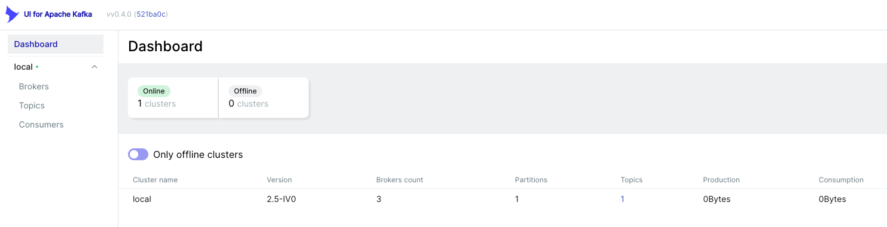

# Kafka UI 툴 이용하기 

- Kafka 브로커를 모니터링하거나, 어드민으로 관리하기 위한 다양한 툴이 존재한다. 
- 이런 다양한 툴들에 대한 비교 설명은 다음 사이트를 참조하자. 

[Overview of UI Tools for Monitoring and Management of Apache Kafka Clusters](https://towardsdatascience.com/overview-of-ui-tools-for-monitoring-and-management-of-apache-kafka-clusters-8c383f897e80)


from: https://towardsdatascience.com/overview-of-ui-tools-for-monitoring-and-management-of-apache-kafka-clusters-8c383f897e80

- 우리는 UI for Apache Kafka 를 이용해 볼 것이다. 

## UI for Apache Kafk

- 자세한 내용은 https://github.com/provectus/kafka-ui 에서 내용을 참조하자. 
- 위툴은 다음과 같은 특성이 있다. 
  - GitHub: https://github.com/provectus/kafka-ui
  - License: Apache 2
  - 비용: 무료
  - 장점: UI가 이쁘고, 유연하며, 기능이 많다.
  - 단점: 아직 개발 중에 있다. 

## 사용하기 구성하기 

- UI for Apache Kafak를 이용하기 위해서는 멀티 클러스터 구성을 하는 것이 좋다. 
- 멀티 브로커를 이용하기 위해서 우리는 docker-compose 를 이용하여 로컬 환경에 멀티 클러스터를 구성할 것이다. 

### Docker-Compose 로 Multiple Kafka Broker 구성하기 

```yaml
---
version: '3.8'
services:
  zookeeper-1:
    image: confluentinc/cp-zookeeper:5.5.1
    ports:
      - '32181:32181'
    environment:
      ZOOKEEPER_CLIENT_PORT: 32181
      ZOOKEEPER_TICK_TIME: 2000


  kafka-1:
    image: confluentinc/cp-kafka:5.5.1
    ports:
      - '9092:9092'
    depends_on:
      - zookeeper-1
    environment:
      KAFKA_BROKER_ID: 1
      KAFKA_ZOOKEEPER_CONNECT: zookeeper-1:32181
      KAFKA_LISTENER_SECURITY_PROTOCOL_MAP: INTERNAL:PLAINTEXT,EXTERNAL:PLAINTEXT
      KAFKA_INTER_BROKER_LISTENER_NAME: INTERNAL
      KAFKA_ADVERTISED_LISTENERS: INTERNAL://kafka-1:29092,EXTERNAL://localhost:9092
      KAFKA_DEFAULT_REPLICATION_FACTOR: 3
      KAFKA_NUM_PARTITIONS: 3


  kafka-2:
    image: confluentinc/cp-kafka:5.5.1
    ports:
      - '9093:9093'
    depends_on:
      - zookeeper-1
    environment:
      KAFKA_BROKER_ID: 2
      KAFKA_ZOOKEEPER_CONNECT: zookeeper-1:32181
      KAFKA_LISTENER_SECURITY_PROTOCOL_MAP: INTERNAL:PLAINTEXT,EXTERNAL:PLAINTEXT
      KAFKA_INTER_BROKER_LISTENER_NAME: INTERNAL
      KAFKA_ADVERTISED_LISTENERS: INTERNAL://kafka-2:29093,EXTERNAL://localhost:9093
      KAFKA_DEFAULT_REPLICATION_FACTOR: 3
      KAFKA_NUM_PARTITIONS: 3
    

  kafka-3:
    image: confluentinc/cp-kafka:5.5.1
    ports:
      - '9094:9094'
    depends_on:
      - zookeeper-1
    environment:
      KAFKA_BROKER_ID: 3
      KAFKA_ZOOKEEPER_CONNECT: zookeeper-1:32181
      KAFKA_LISTENER_SECURITY_PROTOCOL_MAP: INTERNAL:PLAINTEXT,EXTERNAL:PLAINTEXT
      KAFKA_INTER_BROKER_LISTENER_NAME: INTERNAL
      KAFKA_ADVERTISED_LISTENERS: INTERNAL://kafka-3:29094,EXTERNAL://localhost:9094
      KAFKA_DEFAULT_REPLICATION_FACTOR: 3
      KAFKA_NUM_PARTITIONS: 3
```

- 위 내용은 kafka-broker 3개와 zookeeper 1개로 구성된 kafka 클러스터이다. 

```go
docker-compose -f docker-compose.yaml up -d
```

- 위 커맨드로 실행하면 kafka 브로커 3개로 구성된 클러스터가 생성이 된다. 
- 접근 포트는 localhost:9092, localhost:9093, localhost:9094 로 접근이 가능하다. 

### UI for Apache Kafka 실행하기. 

- UI툴 역시 동일하게 Docker-Compose를 이용할 것이다. 

```yaml
version: '2'
services:
  kafka-ui:
    image: provectuslabs/kafka-ui
    container_name: kafka-ui
    ports:
      - "8989:8080"
    restart: always
    environment:
      - KAFKA_CLUSTERS_0_NAME=local
      - KAFKA_CLUSTERS_0_BOOTSTRAPSERVERS=kafka-1:29092,kafka-2:29093,kafka-3:29094
      - KAFKA_CLUSTERS_0_ZOOKEEPER=zookeeper-1:22181
```

- 위 설정은 docker-compose 로컬 환경에서 수행할 수 있도록 kafka 엔드포인트와, zookeeper 엔드포인트를 환경 변수에 정의해 두었다. 
- docker-compose 내부의 서비스 이름으로 접근하므로 kafka-1, zookeeper-1 의 형태로 접근한다. 

```go
docker-compose -f docker-compose-kafka-ui.yaml up -d
```

## 화면 메뉴 알아보기 

- 일단 설치가 되면 화면에 접근해보자. 
- http://localhost:8989 로 접근하면 다음과 같은 화면을 확인할 수 있다. 

### 메인 대시보드 



- Online: 현재 UI와 연결되어 정상적으로 수행되고 있는 클러스터 개수 1개로 되어 있다. 
- 상세정보
  - Cluster name: local - 클러스터 이름
  - Version: 2.5-IV0 
  - Brokers count: 현재 카프카 브로커 개수를 나타낸다.
  - Partitions: 현재 존재하는 파티션 개수 1개가 나타난다.
  - Topics: 1 기본 토픽이 생성되어 있어 1개로 지정되었다. 클러스터에서 이용하는 기본 토픽이다. 
  - Production: 발행한 메시지 용량 
  - Consumption: 수신한 메시지 용량

### Broker 목록화면


- Uptime
  - Total Brokers: 총 브로커 개수이다. 
  - Active Controllers: 활동 컨트롤러
  - Version: 2.5-IV0
- Partitions
  - Online: 현재 온라인 개수는 1로 설정되어 있다. 
  - URP: 복제가 덜 된 파티션수 (Un Replication Partitions)
  - In Sync Replicas: 싱크 리플리카 3개로 현재 모두 싱크가 되어 있음을 알 수 있다. 
  - Out of Sync Replicas: 싱크가 맞지 않는 리플리카 개수를 나타낸다. 현재는 0개이다.
- 상세정보
  - Broker: 각각 브로커를 구분해서 볼 수 있다. 
  - Segment Size(Mb): 세그먼트 바이트를 나타낸다. 초기이므로 0바이트이다. 세그먼트는 파티션내부에 분리된 영역을 나타낸다. 
  - Segment Count: 세그먼트 개수를 나타낸다. 
  - Port: 현재 브로커의 포트 번호이다. 
  - Host: 호스트 이름은 kafka-1 ~ 3 으로 나타난다. 

### Topics


- 현재 생성된 모든 토픽을 나타낸다. 
- _confluent.support.metrics: 은 confluent에서 지원되는 메트릭 정볼르 위한 토픽이다. 
- 상세정보
  - Topic Name: 현재 존재하는 토픽 이름 
  - Total Partitions: 토픽의 총 파티션 개수 
  - Out of sync replicas: 복제 싱크가 맞지 않는 복제 개수
  - Replication Factor: 복제 팩터 (복제 개수는 브로커 개수보다 작게 설정하는 것이 일반적이다.)
  - Number of messages: 메시지 수
  - Size: 메시지 총 크기  
  
#### Topic 생성하기 

- 토픽 생성을 위해서 'Add a Topic' 버튼을 클릭한다. 


- 토픽 생성을 위한 화면이 나타난다. 
  - Topic Name: 생성할 토픽 이름 
  - Number of partitions: 생성할 파티션 개수 
  - Replication Factor: 복제 계수 
  - Min in Sync Replicas: 최소 복제 싱크 계수
  - Cleanup Policy: 클린업을 위한 정책(메시지 클린을 위한 정책)
    - Delete: 리텐션 기간이 지나면 삭제한다. 
    - Compact: 압축을 수행한다. 
    - Compact, Delete: 압축후 삭제한다. 
  - Time to retain data (in ms) : 데이터를 저장할 기간을 지정한다. 
  - Max size on disk in GB: 디스크 최대 크기를 지정한다. 
  - Maximum message size in bytes: 최대 메시지 크기 
  - Custom parameters: 추가적인 파라미터 정보를 지정할 수 있다. 

### Consumers


- 클러스터에 연동된 컨슈머 정보를 나타낸다. 
- 상세정보
  - Consumer Group ID: 컨슈머 그룹 아이디
  - Number Of Members: 컨슈머 그룹의 멤버수 
  - Num Of Topics: 컨슈머 그룹의 토픽 수
  - Message Behind:
  - Coordinator
  - State: 컨슈머 상태 

## Producer 와 컨슈머가 연결된 이후의 정보 

- Producer, Consumer를 각각 실행하고 난 후 Topics와 Consumers 를 확인해 보자. 

### 토픽 정보


- 생성된 토픽
  - TOPIC1 
    - 파티션개수: 1개
    - 싱크가 맞지 않는 복제수: 0개
    - 복제 팩터: 1
    - 사용된 메시지수: 4
  - TOPIC2
    - 파티션개수: 1개
    - 싱크가 맞지 않는 복제수: 0개
    - 복제 팩터: 1
    - 사용된 메시지수: 0
  - TOPIC3TEST
    - 파티션개수: 3개
    - 싱크가 맞지 않는 복제수: 0개
    - 복제 팩터: 2
    - 사용된 메시지수: 7
  - __confluent.support.metrics: 컨플루언트에서 지정한 메트릭 정보를 위한 토픽
  - __consumer_offsets: 컨슈머 오프셋을 위한 토픽 (컨슈머는 파티션마다 오프셋을 가지고 있으며 이들 정보를 저장한다.)
  - __transaction_state: 카프카 메시지에 트랜잭션을 적용한경우 상태 정보를 저장할 토픽이다.


- 위와 같이 토픽의 체크박스를 선택하면 토픽에 대해서 몇가지 작업을 수행할 수 있다. 
- 오퍼레이션
  - Delete selected topics: 선택된 토픽을 삭제한다. 
  - Copy selected topic: 선택된 토픽을 하나더 복제한다.
  - Purge message of selected topics: 선택된 토픽의 메시지를 퍼지한다. (삭제된 메시지를 제거하는 것을 수행한다.)

### 토픽 상세정보

- 토픽 이름을 클릭하면 토픽의 상세 정보를 확인할 수 있다. 
  
#### 토픽 오버뷰 


- Partitions: 토픽의 파티션 개수
- Replication Factor: 복제 계수
- URP(Un Replication Partition): 복제가 되지 않은 파티션개수
- In Sync Replicas: 복제 싱크 개수
- Type: External
- Segment Size: 세그먼트 크기
- Segment Count: 세그먼트 개수
- Clean Up Policy: 메시지 보관 기간 이후 제거 정책 DELETE (삭제) 처리
- Message Count: 메시지 카운트
- 파티션 상세정보
  - Partition ID: 파티션 아이디
  - Broker Leader: 브로커 리더 번호
  - First Offset: 첫번째 오프셋
  - Next Offset: 다음 오프셋
  - Message Count: 메시지 카운트

#### Messages

- 토픽 내부의 메시지 정보 
  


- 'Produce Message' : 메시지를 생성할 수 있는 버튼이다. 
- 메시지 검색창에서 메시지 내용을 검색할 수 있다. 
- 메시지 목록 상세
  - Offset: 메시지 오프셋
  - Partition: 파티션 번호
  - Timestamp: 메시지 타임스템프
  - Key: 키가 존재하는 경우 키가 노출된다. 
  - Content: 메시지 내용 


- 위 이미지는 메시지 전송 버튼 클릭시 메시지 입력 창을 확인할 수 있다. 
- 메시지 키와, 내용, 그리고 헤더정보를 입력하고 전송할 수 있다. 


- 위 화면은 Edit Setting 버튼 클릭시 메시지 삭제, 토픽 재 생성등 다양한 일을 수행할 수 있다. 

#### Consumers

- 토픽에 연결된 컨슈머를 노출한다. 


- 상세정보
  - Consumer Group ID: 컨슈머 그룹 아이디 
  - Num Of Member: 컨슈머 그룹내 컨슈머 개수
  - Message Behind:
  - Coordinator:
  - State: Stable 로 안정적이다라고 표시된다. 

#### Settings

- 토픽의 상태 정보를 확인할 수 있다. 


- 토픽 상세 정보는 현재 토픽의 다양한 정보를 볼 수 있으며 https://docs.confluent.io/platform/current/installation/configuration/topic-configs.html 등에서 알아볼 수 있다.

### Consumers

- 컨슈머 정보를 확인할 수 있다. 
  


## Wrap Up

- UI for Apache Kafka 는 기능도 매우 많으며, 카프카 관리를 위한 다양한 기능을 제공하고 있다. 
- 특히 kafka의 토픽과 파티션 등을 직접 확인해 볼 수 있는 것은 매우 훌륭한 기능이라고 할 수 있을 것이다. 
- 토픽을 직접 생성할 수도 있으며, 어플리케이션에서 KafkaAdmin 객체를 이용하여 생성할 수도 있다. 
- 해당 토픽에 메시지가 publish되거나, consume 되는 경우 우리가 확인한 데이터의 흐름, 메시지 내용등을 직접 확인할 수 있다. 