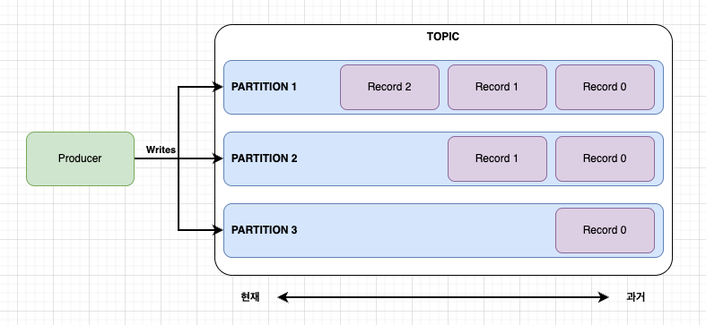
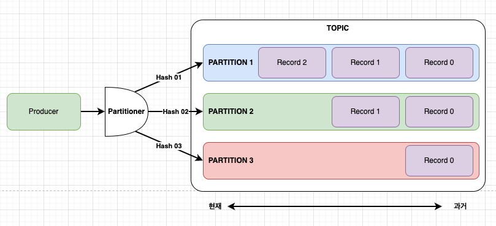
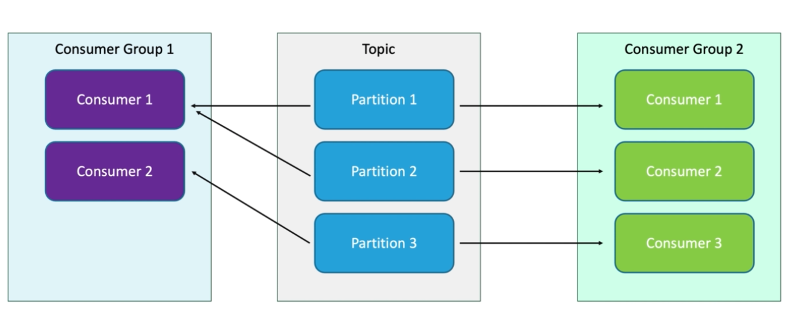

# Kafka 읽기/쓰기 동작 방식 

- kafka는 반드시 토픽(TOPIC)을 가진다. 
- Topic은 특정 메시지를 주고 받는 통로 역할을 한다. 
- Topic내부에는 여러개의 파티션을 가질 수 있다. 

## Kafka 쓰기 동작방식 

- kafka 프로듀서는 레코드를 생성하고 kafka 브로커 내, 특정 토픽내의 파티션으로 레코드를 전달한다. 

### Kafka 쓰기 동작

- kafka는 브로커 내 Topic을 가진다. 
- kafka 토픽에는 여러개의 파티션을 가진다. 
- Writer는 레코드를 생성하면, 지정된 토픽의 특정 파티션으로 레코드를 전달하게 된다. 
- 파티션은 키를 사용하는 경우 해시 값으로 파티션을 결정하고, 키를 사용하지 않으면 라운드 로빈으로 레코드를 전달한다. 

### Offset (오프셋)

- offset은 레코드의 위치를 나타낸다. 
- producer offset은 그림과 같이 최초 0번째의 위치를 가진다. 
- 메시지가 들어올때마다 producer offset은 최신 위치를 가리키게 된다. 

### 메시지별로 파티션 구분하기 

- kafka 레코드키가 없는경우 
  - 라운드로빈으로 파티션에 레코드를 할당함 
- kafka 레코드키가 있는경우 
  - 카프카 파티셔너에서 키를 해싱 --> 해당하는 파티션으로 레코드 전달 
  - 동일키는 항상 동일한 파티션으로 들어감  

- 위 그림은 레코드 키를 가지고 있는 경우이며, 각각 레코드에 따라 해싱된 결과 파티션으로 레코드가 전달되게 된다. 
- 즉, 동일한 해시 결과를 가진 키를 가진 레코드는 동일한 파티션에만 들어가므로, 파티션내 순서가 보장된다.

## Kafka 읽기 동작방식 

- 카프카의 레코드는 컨슈머에 의해서 읽게 된다. 
- 하나의 컨슈머는 하나의 파티션의 레코드를 읽게 된다. 

### kafka consumer offset

- kafka는 offset을 통해서 레코드를 읽게 된다. 
- 레코드를 파티션으로 부터 읽어오고, 특정 처리를 수행한다. 처리가 완료되면 커밋을 브로커로 보내서 처리가 완료 되었음을 알려준다. 
  

- 컨슈머는 레코드를 읽을때 마다 offset 위치를 다음 레코드로 이동한다. 
- 컨슈머는 레코드를 읽고, 처리를 수행하며, 결과를 kafka에 알리게 되며, 이때 offset이 다음 레코드로 이동하는 구조이다. 

### At Most Once 

- 메시지를 1번만 읽는다. 
- 컨슈머가 메시지를 읽고 바로 commit를 전송한다. 
- 메시지가 유실될 수 있다. 
- 메시지 처리가 빠르다. 

### At Leat Once 

- 메시지를 읽고, 메시지를 처리하고난 뒤 commit 를 전송하는 방식이다. 
- 메시지가 유실되지 않는다. 
- 메시지 처리도중 오류가 나면 메시지를 다시 읽는다. (즉, 중복 읽기, 처리가 발생한다.)
- 중복으로 읽고 처리가 될 수 있으므로 컨슈머는 멱등성을 지킬 수 있도록 처리가 필요하다.

### Exactly Once 

- 메시지를 정확히 1번만 실행한다. 
- 메시지를 읽고, 메시지 처리동안 트랜잭션을 건다. 
- 트랜잭션이 완료되고 나면 commit이 이루어진다. 
- 오류가 나더라도 트랜잭션으로 인해서 메시지는 1번만 수행되도록 처리된다. 

### Consumer Group 

- 컨슈머는 반드시 하나의 컨슈머 그룹에 들어간다. 
- 컨슈머 그룹은 파티션 데이터를 논리적으로 독립되게 읽게 된다. 
- 파티션과 컨슈머 그룹내 컨슈머 개수가 동일하면 파티션 하나에 컨슈머 하나가 매칭 
- 파티션 개수보다 컨슈머 그룹의 컨슈머 개수가 작은경우 특정 컨슈머가 남은 파티션 레코드를 읽게 된다. 
- 파티션 개수보다 컨슈머 그룹의 컨슈머 개수가 많은경우 여분의 컨슈머는 메시지를 읽을 수 없다. 

 

- 컨슈머 그룹별로 토픽의 메시지는 독립적으로 읽게 된다. 
- 즉, 동일한 메시지를 2개의 컨슈머 그룹이 읽을 수 있다. 

## WrapUp

- 지금까지 카프카 토픽과 파티션 그리고 컨슈머, 컨슈머 그룹에 대해서 알아 보았다. 
- 컨슈머 입장에서 메시지를 여러번 읽을 수 있을지, 한번만 읽을지 여부에 따라 3가지 옵션 (At Most Once
, At Leat Once, Exactly Once) 이 있다.
