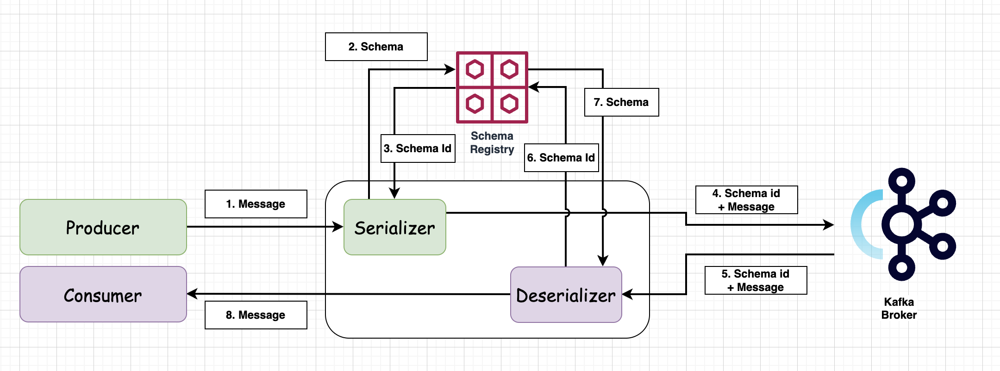

# kafka schema repository

- kafka 는 메시지를 전달할때 메시지를 바이트로 전송하고, 수신받도록 한다. 
- 이때 메시지를 바이트로 변환하는 과정을 serialize라고 하고, 바이트에서 다시 메시지 구조로 변환하는 것을 deserialize라고 한다.
- kafka schema repository 는 메시지를 프로듀싱/컨슈밍을 수행할때 상호간의 프로토콜을 맞추기 위한 하나의 방편이다. 
- 프로듀싱을 수행할때 스키마 아이디와 자료구조를 schema repository에 등록해두고, 메시지를 형식에 맞추어 전달한다. 
- 그리고 컨슈머는 스키마 아이디를 이용하여 전달된 바이너리 데이터를 스키마 구조에 맞게 파싱하여 메시지를 처리한다. 
- 이렇게 메시지를 주고 받는 형식을 상호간 맞춰주면 잘못된 자료형의 데이터 때문에 메시지 처리가 실패하는 일을 방지할 수 있다. 

## 기능

- 메시지의 스키마를 등록저장 (이때 스키마 subject에 따라 저장한다. 그리고 스키마 아이디를 통해서 저장된다.)
- 메시지 스미카 관리를 위한 REST API 제공
- 메시지 스키마의 조회/관리

## Overview

- Schema Registry는 다음과 같이 동작한다. 



- 1. 프로듀서는 메시지를 생성한다. 이때 자동 생성된 스키마 타입을 kafka schema registry의 툴을 이용하여 생성한다. 
- 2. Serializer 를 통과할때 Schema Registery 와 연결하여 Schema를 등록한다. 
- 3. Schema 가 등록되면, Schema id를 수신받을 수 있다. 
- 4. 바이너리화된 메시지(Serialized Message) 를 Kafka로 전달한다. 이때 SchemaId + Message 로 메시지가 전달된다. 
- 5. Kafka 로 부터 바이너리 메시지를 수신받는다. 
- 6. Deserializer 에서 SchemaId를 이용하여 Schema Registry에 조회한다. 
- 7. Schema Registry로 부터 등록된 스키마 정의를 수신받는다. 
- 8. Deserialized된 메시지를 컨슈머가 수신하고 처리를 수행한다. 

## Kafka broker 실행 및 Schema Registry 등록하기. 

- docker-compose.yaml 파일을 생성하고 다음과 같이 작성한다. 
  
```go
---
version: '3.8'
services:
  zookeeper-1:
    image: confluentinc/cp-zookeeper:5.5.1
    ports:
      - '32181:32181'
    environment:
      ZOOKEEPER_CLIENT_PORT: 32181
      ZOOKEEPER_TICK_TIME: 2000


  kafka-1:
    image: confluentinc/cp-kafka:5.5.1
    ports:
      - '9092:9092'
    depends_on:
      - zookeeper-1
    environment:
      KAFKA_BROKER_ID: 1
      KAFKA_ZOOKEEPER_CONNECT: zookeeper-1:32181
      KAFKA_LISTENER_SECURITY_PROTOCOL_MAP: INTERNAL:PLAINTEXT,EXTERNAL:PLAINTEXT
      KAFKA_INTER_BROKER_LISTENER_NAME: INTERNAL
      KAFKA_ADVERTISED_LISTENERS: INTERNAL://kafka-1:29092,EXTERNAL://localhost:9092
      KAFKA_DEFAULT_REPLICATION_FACTOR: 3
      KAFKA_NUM_PARTITIONS: 3


  kafka-2:
    image: confluentinc/cp-kafka:5.5.1
    ports:
      - '9093:9093'
    depends_on:
      - zookeeper-1
    environment:
      KAFKA_BROKER_ID: 2
      KAFKA_ZOOKEEPER_CONNECT: zookeeper-1:32181
      KAFKA_LISTENER_SECURITY_PROTOCOL_MAP: INTERNAL:PLAINTEXT,EXTERNAL:PLAINTEXT
      KAFKA_INTER_BROKER_LISTENER_NAME: INTERNAL
      KAFKA_ADVERTISED_LISTENERS: INTERNAL://kafka-2:29093,EXTERNAL://localhost:9093
      KAFKA_DEFAULT_REPLICATION_FACTOR: 3
      KAFKA_NUM_PARTITIONS: 3
    

  kafka-3:
    image: confluentinc/cp-kafka:5.5.1
    ports:
      - '9094:9094'
    depends_on:
      - zookeeper-1
    environment:
      KAFKA_BROKER_ID: 3
      KAFKA_ZOOKEEPER_CONNECT: zookeeper-1:32181
      KAFKA_LISTENER_SECURITY_PROTOCOL_MAP: INTERNAL:PLAINTEXT,EXTERNAL:PLAINTEXT
      KAFKA_INTER_BROKER_LISTENER_NAME: INTERNAL
      KAFKA_ADVERTISED_LISTENERS: INTERNAL://kafka-3:29094,EXTERNAL://localhost:9094
      KAFKA_DEFAULT_REPLICATION_FACTOR: 3
      KAFKA_NUM_PARTITIONS: 3

  schema-registry:
    image: confluentinc/cp-schema-registry:latest
    platform: linux/x86_64
    environment:
      SCHEMA_REGISTRY_KAFKASTORE_BOOTSTRAP_SERVERS: "kafka-1:29092,kafka-2:29093,kafka-3:29094"
      SCHEMA_REGISTRY_HOST_NAME: schema-registry
    depends_on:
      - zookeeper-1
      - kafka-1
      - kafka-2
      - kafka-3
    ports:
      - '8081:8081'
```

- 그리고 다음 명령으로 실행한다.

```go
docker-compose -f docker-compose.yaml up -d
```

## Apache Avro

- Apache Avro는 데이터 serialization system 이다. 
- https://www.baeldung.com/java-apache-avro 를 참조하자. 
- JSON의 형태로 스키마 구조를 정의한다. 
- 데이터와 바이트 사이의 데이터 구조를 serialize한다.
- 메시지 진화를 지원하며, 스키마 아이디를 통해 스키마의 버젼을 지원한다. 
- Avro 툴셋을 이용하면 스키마를 이용하여 자동으로 메시지 타입을 생성할 수 있다. 

## SpringBoot 예제

### POM 의존성 추가하기. 

- Schema Registry를 이용하겨, Avro를 통해서 직렬화/역직렬화를 수행하기 위해서 다음과 같이 pom.xml 에 추가한다. 

```xml
		<dependency>
			<groupId>org.springframework.cloud</groupId>
			<artifactId>spring-cloud-stream-binder-kafka</artifactId>
			<version>3.2.4</version>
		</dependency>

		<dependency>
			<groupId>org.springframework.cloud</groupId>
			<artifactId>spring-cloud-stream-schema</artifactId>
			<version>2.2.1.RELEASE</version>
		</dependency>

		<dependency>
			<groupId>io.confluent</groupId>
			<artifactId>kafka-avro-serializer</artifactId>
			<version>4.0.0</version>
		</dependency>
```

- 위와 같이 스프링 클라우드 바인더는 스프링 클라우드 kafka를 이용하기 위한 라이브러리다. 
- spring-cloud-stream-schema 를 등록하여 schema repository를 사용할 수 있도록 했다. 
- kafka-avro-serializer를 등록하고, 메시지를 Avro로 변환하도록 해준다. 

### avro 를 이용한 클래스 생성하기

- 스키마 개체 자동생성을 위해서 다음 내용을 추가한다. 
  
```xml
	<repositories>
			<repository>
					<id>confluent</id>
					<url>https://packages.confluent.io/maven/</url>
			</repository>
	</repositories>
```

- 위 내용은 confluent 의 패키지를 조회할 수 있도록 리포지토리를 등록했다. 

```xml
    <plugin>
        <groupId>org.apache.avro</groupId>
        <artifactId>avro-maven-plugin</artifactId>
        <version>1.8.2</version>
        <executions>
            <execution>
                <id>schemas</id>
                <phase>generate-sources</phase>
                <goals>
                    <goal>schema</goal>
                    <goal>protocol</goal>
                    <goal>idl-protocol</goal>
                </goals>
                <configuration>                        
                    <sourceDirectory>${project.basedir}/src/main/resources/</sourceDirectory>
                    <outputDirectory>${project.basedir}/src/main/java/</outputDirectory>
                </configuration>
            </execution>
        </executions>
    </plugin>
```

- 위와 같이 소스 generator 플러그인을 추가하였다. 
- 위 코드로 avro 스키마 파일을 읽고 자동생성된 코드를 출력한다. 
  - /src/main/resources 에서 스키마 정의를 읽는다. 
  - /src/main/java 에 결과를 클래스를 생성하게 된다. 

### Avro Schema 리포지토리를 생성한다. 

- /src/main/resources 디렉토리에 user-schema.avsc 파일을 생성하고 다음과 같이 작성하자. 

```java
{
    "type": "record",
    "name": "User",
    "namespace": "com.schooldevops.kafkatutorials.schema",
    "fields": [
        {
            "name": "id",
            "type": "int"
        },
        {
            "name": "firstName",
            "type": "string"
        },
        {
            "name": "lastName",
            "type": "string"
        }
    ]
}
```

- type: record: 레코드 타입의 스키마를 지정한다. 
- name: User: 스키마 이름이다. 이 이름으로 스키바 레지스트리에 저장된다. 
- namespace: 코드가 생성될 패키지 이름으로 등록한다.
- fields: 스키마 정의 내역을 추가한다. 배열 타입의 JSON으로 등록한다. 

<br/>

- 위와 같이 작성한 후 다음 명령으로 코드를 생성할 수 있다. 

```go
mvn clean compile
```

- 코드가 실행되면 '/src/main/java/com.schooldevops.kafkatutorials.schema/User.java' 파일이 생성된다. 

### application.properties 생성하기

```go
# Kafka endpoint for endpoint
kafka.bootstrap-servers=localhost:9092,localhost:9093,localhost:9094
kafka.schemal.registry.url=http://localhost:8081

server.port=8089
```

- kafka.bootstrap-servers
  - kafka 브로커의 목록을 기술한다. 
- kafka.schemal.registry.url
  - 생성된 스키마 경로를 지정한다. 
- server.port
  - 어플리케이션의 서버 포트를 지정한다. 

### 설정파일 작성하기. 

- 이제 kafka 클라이언트 설정을 수행하자. 

#### KafkaAdminConfig 등록하기

- KafakAdminConfig.java 를 생성하고 다음과 같이 작성한다. 
- 이 코드를 통해서 토픽을 생성할 수 있다. 

```java
package com.schooldevops.kafkatutorials.configs;

import org.apache.kafka.clients.admin.AdminClientConfig;
import org.springframework.beans.factory.annotation.Value;
import org.springframework.context.annotation.Bean;
import org.springframework.context.annotation.Configuration;
import org.springframework.kafka.core.KafkaAdmin;

import java.util.HashMap;
import java.util.Map;

@Configuration
public class KafkaAdminConfig {

    @Value("${kafka.bootstrap-servers}")
    private String bootstrapServer;

    @Bean
    public KafkaAdmin kafkaAdmin() {
        Map<String, Object> configs = new HashMap<>();
        configs.put(AdminClientConfig.BOOTSTRAP_SERVERS_CONFIG, bootstrapServer);

        return new KafkaAdmin(configs);
    }
}

```

- 위와 같이 kafkaAdmin 빈이 등록되었다. 

#### Topic 생성하기

- KafkaAdmin 빈이 있다면 토픽을 생성할 수 있게 된다. 
- KafkaTopicConfig.java 파일을 다음과 같이 작성한다. 

```java
package com.schooldevops.kafkatutorials.configs;

import org.apache.kafka.clients.admin.NewTopic;
import org.apache.kafka.common.config.TopicConfig;
import org.springframework.beans.factory.annotation.Autowired;
import org.springframework.context.annotation.Configuration;
import org.springframework.kafka.config.TopicBuilder;
import org.springframework.kafka.core.KafkaAdmin;

import javax.annotation.PostConstruct;

@Configuration
public class KafkaTopicConfig {

    public final static String DEFAULT_TOPIC = "DEF_TOPIC";

    @Autowired
    private KafkaAdmin kafkaAdmin;

    private NewTopic defaultTopic() {
        return TopicBuilder.name(DEFAULT_TOPIC)
                .partitions(1)
                .replicas(1)
                .build();
    }

    @PostConstruct
    public void init() {
        kafkaAdmin.createOrModifyTopics(defaultTopic());
    }
}

````

#### Producer 설정하기. 

- KafkaProducerConfig.java 파일을 만들어 다음과 같이 작성한다. 

```java
package com.schooldevops.kafkatutorials.configs;

import io.confluent.kafka.serializers.KafkaAvroSerializer;
import io.confluent.kafka.serializers.KafkaAvroSerializerConfig;
import org.apache.kafka.clients.producer.ProducerConfig;
import org.apache.kafka.common.serialization.StringSerializer;
import org.springframework.beans.factory.annotation.Value;
import org.springframework.context.annotation.Bean;
import org.springframework.context.annotation.Configuration;
import org.springframework.kafka.core.DefaultKafkaProducerFactory;
import org.springframework.kafka.core.KafkaTemplate;
import org.springframework.kafka.core.ProducerFactory;
import org.springframework.kafka.support.serializer.JsonSerializer;

import java.util.HashMap;
import java.util.Map;

@Configuration
public class KafkaProducerConfig {

    @Value("${kafka.bootstrap-servers}")
    private String bootstrapServer;

    @Value("${kafka.schemal.registry.url}")
    private String schemaRegistryServer;

    private ProducerFactory<String, Object> producerFactory() {
        Map<String, Object> configProps = new HashMap<>();
        configProps.put(ProducerConfig.BOOTSTRAP_SERVERS_CONFIG, bootstrapServer);
        configProps.put(ProducerConfig.KEY_SERIALIZER_CLASS_CONFIG, StringSerializer.class);
        configProps.put(ProducerConfig.VALUE_SERIALIZER_CLASS_CONFIG, KafkaAvroSerializer.class);
        configProps.put(KafkaAvroSerializerConfig.SCHEMA_REGISTRY_URL_CONFIG, schemaRegistryServer);

        return new DefaultKafkaProducerFactory<>(configProps);
    }

    @Bean
    public KafkaTemplate<String, Object> kafkaProducerTemplate() {
        return new KafkaTemplate<>(producerFactory());
    }
}
```

- 여기에서 중요한 포인트는 다음과 같다. 
  - configProps.put(ProducerConfig.VALUE_SERIALIZER_CLASS_CONFIG, KafkaAvroSerializer.class) 에서 Avro직렬화를 지정한다. 
  - configProps.put(KafkaAvroSerializerConfig.SCHEMA_REGISTRY_URL_CONFIG, schemaRegistryServer) 직열화를 위한 스키마 리포지토리를 등록한다. 

#### ConsumerCofig 설정하기.

- KafkaConsumerConfig.java 파일을 다음과 같이 작성하자. 

```java
package com.schooldevops.kafkatutorials.configs;

import com.fasterxml.jackson.databind.annotation.JsonDeserialize;
import io.confluent.kafka.serializers.KafkaAvroDeserializer;
import io.confluent.kafka.serializers.KafkaAvroDeserializerConfig;
import io.confluent.kafka.serializers.KafkaAvroSerializer;
import io.confluent.kafka.serializers.KafkaAvroSerializerConfig;
import org.apache.kafka.clients.consumer.Consumer;
import org.apache.kafka.clients.consumer.ConsumerConfig;
import org.apache.kafka.clients.consumer.ConsumerRecord;
import org.apache.kafka.clients.producer.ProducerConfig;
import org.apache.kafka.common.serialization.StringDeserializer;
import org.springframework.beans.factory.annotation.Value;
import org.springframework.context.annotation.Bean;
import org.springframework.context.annotation.Configuration;
import org.springframework.kafka.annotation.EnableKafka;
import org.springframework.kafka.config.ConcurrentKafkaListenerContainerFactory;
import org.springframework.kafka.core.ConsumerFactory;
import org.springframework.kafka.core.DefaultKafkaConsumerFactory;
import org.springframework.kafka.support.serializer.JsonDeserializer;

import java.util.HashMap;
import java.util.Map;

@EnableKafka
@Configuration
public class KafakConsumerConfig {

    @Value("${kafka.bootstrap-servers}")
    private String bootstrapServer;

    @Value("${kafka.schemal.registry.url}")
    private String schemaRegistryServer;
    private ConsumerFactory<String, Object> consumerFactory(String groupId) {
        Map<String, Object> props = new HashMap<>();

        props.put(ConsumerConfig.BOOTSTRAP_SERVERS_CONFIG, bootstrapServer);
        props.put(ConsumerConfig.GROUP_ID_CONFIG, groupId);
        props.put(ConsumerConfig.KEY_DESERIALIZER_CLASS_CONFIG, StringDeserializer.class);
        props.put(ConsumerConfig.VALUE_DESERIALIZER_CLASS_CONFIG, KafkaAvroDeserializer.class);
        props.put(KafkaAvroDeserializerConfig.SCHEMA_REGISTRY_URL_CONFIG, schemaRegistryServer);

        return new DefaultKafkaConsumerFactory<>(props);
    }

    @Bean
    public ConcurrentKafkaListenerContainerFactory<String, Object> defaultKafkaListenerContainerFactory() {
        ConcurrentKafkaListenerContainerFactory<String, Object> factory = new ConcurrentKafkaListenerContainerFactory<>();
        factory.setConsumerFactory(consumerFactory("defaultGroup"));
        factory.setConcurrency(1);
        factory.setAutoStartup(true);
        return factory;
    }
}
```

- 여깃 중요 포인트는 다음과 같다. 
  - props.put(ConsumerConfig.VALUE_DESERIALIZER_CLASS_CONFIG, KafkaAvroDeserializer.class) Avro 역 직렬화를 등록한다. 
  - props.put(KafkaAvroDeserializerConfig.SCHEMA_REGISTRY_URL_CONFIG, schemaRegistryServer) 역 직렬화를 위한 스키마 리포지토리를 등록한다. 

#### 메시지 수신받아 전달하기. 

- ProducerController.java 파일을 다음과 같이 작성하자. 

```java
package com.schooldevops.kafkatutorials.controllers;

import com.schooldevops.kafkatutorials.configs.KafkaTopicConfig;
import com.schooldevops.kafkatutorials.schema.User;
import lombok.extern.slf4j.Slf4j;
import org.springframework.http.ResponseEntity;
import org.springframework.kafka.core.KafkaTemplate;
import org.springframework.kafka.support.SendResult;
import org.springframework.util.concurrent.ListenableFuture;
import org.springframework.util.concurrent.ListenableFutureCallback;
import org.springframework.web.bind.annotation.PostMapping;
import org.springframework.web.bind.annotation.RequestBody;
import org.springframework.web.bind.annotation.RequestMapping;
import org.springframework.web.bind.annotation.RestController;

@Slf4j
@RestController
@RequestMapping("/api")
public class ProducerController {

    private final KafkaTemplate<String, Object> kafkaProducerTemplate;

    public ProducerController(KafkaTemplate<String, Object> kafkaProducerTemplate) {
        this.kafkaProducerTemplate = kafkaProducerTemplate;
    }

    @PostMapping("avro")
    public ResponseEntity<?> avroMessage(@RequestBody User user) {

        ListenableFuture<SendResult<String, Object>> future = kafkaProducerTemplate.send(KafkaTopicConfig.DEFAULT_TOPIC, user);

        future.addCallback(new ListenableFutureCallback<SendResult<String, Object>>() {
            @Override
            public void onFailure(Throwable ex) {
                log.error("Fail to send message to broker: {}", ex.getMessage());
            }

            @Override
            public void onSuccess(SendResult<String, Object> result) {
                log.info("Send message with offset: {}, partition: {}", result.getRecordMetadata().offset(), result.getRecordMetadata().partition());
            }
        });

        return ResponseEntity.ok(user.getFirstName());
    }
}

```

- 메시지를 POST를 통해서 수신받는다. 
- 이때 메시지는 User (자동으로 생성된 스키마 객체이다.) 로 Json 데이터를 수신 받는다. 
- 그리고 생성된 토픽으로 kafkaProducerTemplate.send(KafkaTopicConfig.DEFAULT_TOPIC, user) 와 같이 등록한다. 

#### Message Consume 수행하기

- MessageListener.java 를 이용하여 메시지를 수신받는다. 

```java
package com.schooldevops.kafkatutorials.consumers;

import com.schooldevops.kafkatutorials.configs.KafkaTopicConfig;
import com.schooldevops.kafkatutorials.schema.User;
import lombok.extern.slf4j.Slf4j;
import org.apache.kafka.clients.consumer.ConsumerRecord;
import org.springframework.kafka.annotation.KafkaListener;
import org.springframework.stereotype.Component;

@Slf4j
@Component
public class MessageListener {

    @KafkaListener(topics = KafkaTopicConfig.DEFAULT_TOPIC, containerFactory = "defaultKafkaListenerContainerFactory")
    public void listenDefaultTopic(ConsumerRecord<String, User> record) {
        log.info("Receive Message from {}, values {}", KafkaTopicConfig.DEFAULT_TOPIC, record);
        log.info("---------------------------" + record);
    }
}

```

- @KafkaListener를 이용하여 메시지를 지정된 토픽에서 수신 받는다. 
- 수신받은 데이터는 'ConsumerRecord<String, User>' 형태로 메시지를 수신받을 수 있게 된다. 


#### 테스트하기

- 메시지를 다음과 같이 전송하면 다음과 같은 결과를 확인할 수 있다. 

```go
curl -X POST 'http://localhost:8089/api/avro' -H 'Content-Type: application/json' -d '{"id": 1, "firstName": "schooldevops", "lastName":"KIDO"}'
```

- 어플리케이션 로그는 다음과 같다. 

```go
2022-07-04 14:40:58.302  INFO 17981 --- [ad | producer-1] c.s.k.controllers.ProducerController     : Send message with offset: 13, partition: 0

2022-07-04 14:40:58.302  INFO 17981 --- [ntainer#0-0-C-1] c.s.k.consumers.MessageListener          : Receive Message from DEF_TOPIC, values ConsumerRecord(topic = DEF_TOPIC, partition = 0, leaderEpoch = 0, offset = 13, CreateTime = 1656913258237, serialized key size = -1, serialized value size = 17, headers = RecordHeaders(headers = [], isReadOnly = false), key = null, value = {"id": 1, "firstName": "schooldevops", "lastName": "KIDO"})
2022-07-04 14:40:58.303  INFO 17981 --- [ntainer#0-0-C-1] c.s.k.consumers.MessageListener          : ---------------------------ConsumerRecord(topic = DEF_TOPIC, partition = 0, leaderEpoch = 0, offset = 13, CreateTime = 1656913258237, serialized key size = -1, serialized value size = 17, headers = RecordHeaders(headers = [], isReadOnly = false), key = null, value = {"id": 1, "firstName": "schooldevops", "lastName": "KIDO"})
```

- 정상적으로 메시지가 전송되고, 수신되었음을 알 수 있다. 

## WrapUp

- 지금까지 Avro를 이용하여 메시지를 직렬화/역직렬화 수행하였다. 
- 그리고 이때 메시지 변환을 위한 스키마 정의를 수행하고, 이 스키마를 Registry에 등록하는 작업을 수행했다. 
- 스키마 리포지토리를 이용하여 메시지 변경에 대한 관리를 안전하게 수행할 수 있다. 

