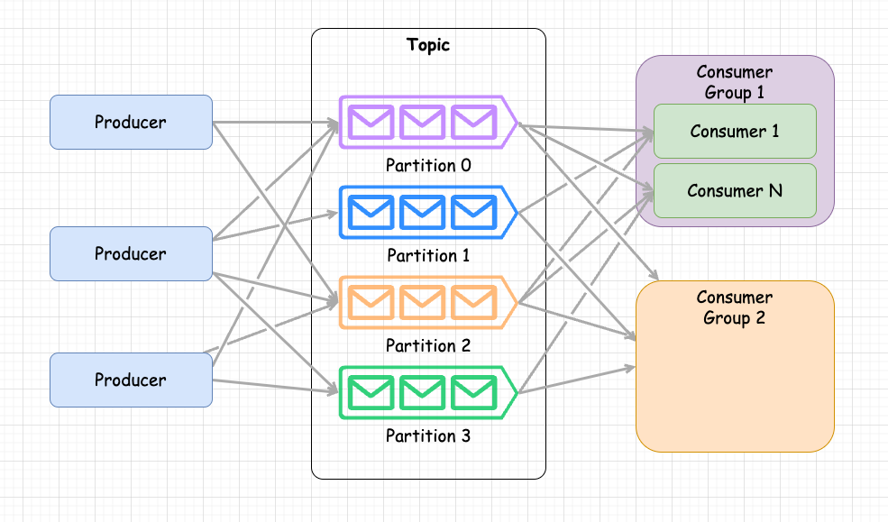
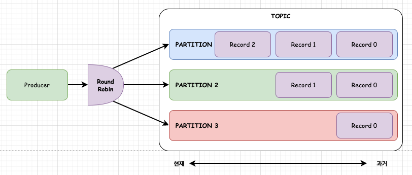
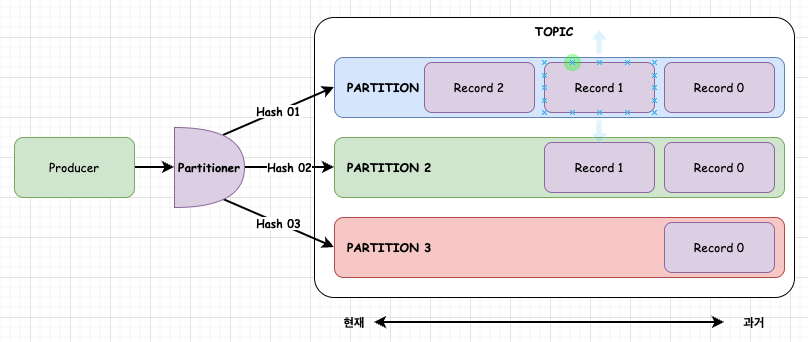
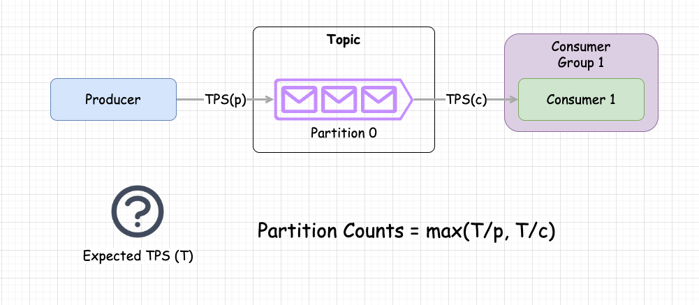
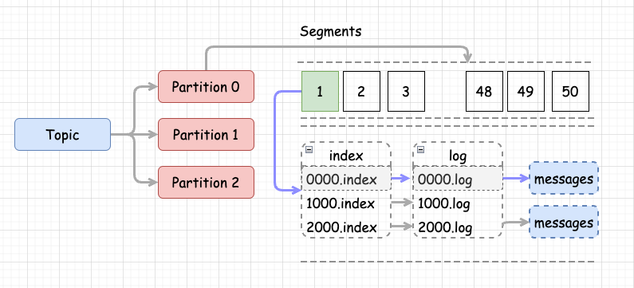

# Kafka 파티션 개수 선정

- Kafka를 운용할때 항상 고민되는 것이 파티션의 개수를 몇개로 두는 것이 좋을 것인지에 대한 고민이다.
- Kafka 파티션을 산정할때 얼마로 두어야하는지 알아보고, 파티션을 증가 시킴으로 해서 고려해야할 사항에 대해서 알아보자. 

## 처리량과 파티션 개수의 관계



- 위 그림과 같이 파티션 개수가 증가되면 병렬성이 증가 된다. 
- 파티션은 개별적으로 메시지를 적재하고, 컨슈머는 파티션 하나에 매핑되어 메시지를 가져가게 된다. 
- 여러 프로듀서가 특정 토픽에 메시지를 쓰기할 수 있으며 이는 병렬적으로 수행된다. 
- 여러 컨슈머 그룹을 설정할 수 있으며, 하나의 컨슈머 그룹에는 여러개의 컨슈머를 가질 수 있다. 
- 컨슈머는 하나 파티션에 매핑되어 메시지를 가져오게 된다. 즉, 파티션 개수만큼 컨슈머를 두면 메시지를 병렬적으로 소비할 수 있게 된다. 
- 결과적으로 파티션 개수에 따라 병렬성 역시 증가 된다라는 것을 알 수 있다. 

```go
파티션 개수 (증가) = 병렬성 (증가)
```

## 파티션 개수를 작게 잡고 처리량의 증가에 따라 늘이면?

- 파티션 개수를 초기에는 작게 잡고, 이후 처리량이 증가하면서 파티션 개수도 늘여주는 전략은 나름 좋은 방법일 수 있다. 
- 그러나 파티션의 개수를 늘일때 주의해야할 점이 있다. 

### 파티션 키를 사용하지 않는경우 



- 파티션 키가 설정되지 않으면 (null)이면, 프로듀서의 파티셔너는 기본값으로 Roune Robin 방식으로 메시지를 파티션에 골고루 분산한다. 
- 이 경우 초기에 파티션을 작게 잡고, 이후 필요한겨우 파티션의 수를 증가시키는 방법이 가능하다. 
- 파티션이 증가하면 증가된 파티션으로 메시지가 분산되기 때문이다. 

### 파티션 키를 사용하는 경우 



- 파티션 키를 사용하게 되면 파티셔너는 키를 해싱한다. 
- 해싱의 기준은 파티션의 개수에 따라 달라지게 되므로, 파티션의 수를 변경하면, 동일한 키에 대해서 해싱 결과가 달라지며, 할당될 파티션 역시 달라지게 된다. 
- 이는 기존에 존재하는 파티션내 메시지를 다시 해싱하여 적정한 위치로 이주하는 파티션 리밸런싱을 수행하게 된다. 
- 이경우 메시지를 생산/소비하는 로직에 큰 변화가 발생하게 되고, 우리가 원하지 않은 동작을 하게 되는 결과를 가져온다. 
- 그러므로 파티션의 개수를 미리 크게 잡아두어야 이런 문제를 방지할 수 있다. 

## 파티션 개수는 어떻게 정할까? 

- 파티션 개수를 증가하면 처리량이 증가한다고 했다. 
- 그리고 파티션은 한번 설정하면 마음대로 늘이거나 하기가 쉽지 않다는 것을 알았다.
- 그렇다고 무한정 파티션 개수를 늘일 수 있을까? 앞으로 나올 내용에서 파티션 개수를 증가하면서 발생할 수 있는 문제를 알아볼 것이다. 
- 그럼 적정 파티션 개수는 어떻게 설정하는 것이 좋을까? 



- 위 그림과 같이 파티션 개수를 산정하기 위해서 다음과 같이 수행한다. 
- 이는 하나의 파티션을 두고, 프로듀서, 컨슈머의 최대 처리량을 측정하여 적정 파티션을 구하는 것이다 .

1. 프로듀서 1개에서 브로커로 메시지를 쓰기한다. 이때 최대 처리량을 (p)라고 한다.
2. 컨슈머 1개에서 브로커로 메시지를 읽기한다. 이때 최대 처리량을 (c)라고 한다. 
3. 우리가 원하는 기대 처리량을 T 라고 설정한다. 
4. 적정 파티션 개수 = max(T/p, T/c) 로 계산한다. 

- 위와 같이 러프하게 파티션 개수를 산정할 수 있다. 
- 프로듀서는 메시지를 압축, 시리얼라이징 등이 최대 처리량 결정에 영향을 줄 것이다.
- 컨슈머는 메시지 압축 해제, 디시리얼라이징, 메시지 처리 등의 시간이 최대 처리량 결정에 영향을 줄 것이다. 
- 보통은 컨슈머의 처리량이 프로듀서의 처리량보다 적을 것이다. 
- 기대 처리량 T는 보통 2 ~ 3년 후에 기대하는 Capacity로 설정해 두는 것이 좋을 것이다.

<br/>

- 예)
  - 만약 프로듀서 처리량이 10M/s 라고 하면 p = 10M이라고 하자. 
  - 만약 컨슈머 처리량이 5M/s 라고 하면 c = 5M이라고 하자. 
  - 우리가 원하는 처리량은 200M/s 라고 한다면 적정 파티션은 다음과 같이 구할 수 있다. 
  - 적정 파티션수 = max(200M/10M, 200M/5M) = max(20, 40) = 40 이 된다.
  - 40개의 파티션을 설정해서 운영하면 우리가 원하는 처리량을 커버할 수 있을 것이다. 

## 파티션이 증가되면서 고려해야할 사항

### 파티션이 증가되면 하나의 브로커에 처리할 수 있는 파일 핸들러 양도 늘어난다.

- 파티션을 증가 시키면 파티션의 구조를 이해할 필요가 있다. 
- 파티션 구조는 아래 그림과 같다. 



- Topic: 토픽은 메시지를 프로듀싱/컨슈밍 하는 통로이다. 
- Partition: 하나의 토픽에는 여러개의 파티션으로 구성된다. 
- Segements: 하나의 파티션에는 여러개의 세그먼트를 가지고 있다. 세그먼트는 메시지를 저장하고, 리텐션이 지나면 효율적으로 메시지를 삭제하기 위한 방안을 제공한다. 
- index: 하나의 세그먼트에는 인덱스 파일 (파일 핸들러가 필요)
- log: 하나의 세그먼트에는 로그 파일 (파일 핸들러가 필요)이 필요하다. 해당 로그에 우리가 쓰기한 메시지가 들어가게 된다. 

<br/>

- 위 구조를 가지고 있으므로 파티션의 개수가 늘어나면, 파티션내부의 세그먼트 개수도 증가하게 된다. 
- 세그먼트에 인덱스파일, 로그파일의 핸들러들이 필요하므로 즉 파일 처리를 위한 핸들러 역시 필요하게 된다. 

<br/>

- 세그먼트 증가로 인한 파일 핸들러 부족은, 운영체제의 최대 파일 핸들러 개수를 증가시키면 핸들러 부족에 대한 이슈를 해소할 수 있다. 

### 파티션 개수가 증가하면, 장애로 인한 이용불가 영역도 증가한다. 

- Kafka는 내부적으로 복제를 지원한다. 
- 복제본을 통해서 가용성과 메시지 지속성이 증가하게 된다. 
- 파티션은 메시지 쓰기가 가능한 리더 파티션과 읽기 전용 복제본을 가진 팔로워 파티션으로 구성된다. 
- 이들은 여러 브로커에 분산 저장되게 된다. 

<br/>

- 이러한 구조에서 브로커가 장애로 깨지면 리더 파티션에 해당하는 영역은 이용불가 상태가 된다. 
- 즉, 파티션 개수가 많아지면 하나의 브로커에 속해있는 리더 파티션 개수도 많아진다. 
- kafka는 장애가 발생하면, 파티션 리더를 자동적으로 선출한다. 이어 다른 복제본이 클라이언트의 요청을 처리할 수 있도록 복제가 수행된다. 
- 이러한 파티션 리더 선출 작업은 매우 빠르게 처리된다. 약 5ms 정도 소요
- 그러나 파티션의 개수가 증가하면 파티션 개수만큼 장애가 발생한 (리더 파티션의 개수 * 리더 선출 5ms) 만큼의 불능 상태가 진행 되는 것이다. 

<br/>

- 단순히 브로커의 노드만 장애가 나는 경우라면 위와 같은 기간동안 불능 상태로 빠지게 되고, 비교적 빠른 시간에 복구가 된다.
- 그러나 만약 컨틀롤러 브로커가 장애가 난다면, 시간이 급격히 증가한다. 
- 이유는 컨트롤러가 정상적으로 동작하도록 컨틀로러 복구 시간이 추가되며, 이후 리더선출 및 복제를 수행하여 요청을 처리해야 하므로 장애 시간이 증가하게 된다.
- 컨트롤러 복구 시간이 얼마인지에 따라 장애 시간이 결정되는 것이다. 

### 종단간 메시지 처리시간 증가 

- 카프카의 처리시간은 프로듀서가 메시지를 브로커에 쓰기하고, 컨슈머가 메시지를 처리하는 시간이다. 
- 메시지를 정상적으로 읽기 위해서는, kafka의 ISR (In Sync Replica) 를 만족해야 메시지가 컨슈머에 보이게 된다. 즉, 복제가 완료되어야 컨슈머가 메시지를 읽을 수 있고, 처리시간에 영향을 주게 된다.
- 하나의 브로커에서 파티션의 복제는 하나의 쓰레드로 복제를 수행하게 된다. 
- 그러므로 파티션의 개수가 증가하면, 메시지의 복제 시간 역시 증가하게 된다. 

<br/>

- 이를 고려한 브로커당 최대 파티션 개수는 100 * (브로커개수) * (복제계수) 만클 가져갈 수 있다.
- 브로커당 파티션 복제 쓰레드는 단일 쓰레드로 수행되므로 브로커 개수를 늘이면 latency 를 줄일 수 있다. 

### 파티션 개수를 늘이면 클라이언트의 메모리가 많이 필요하다. 

- 프로듀서는 브로커로 메시지를 보내기 전에 메시지 버퍼링을 수행한다. 
- 버퍼링된 메시지는 특정 양의 메시지가 적재 되거나, 특정 시간이 경과한 후 한번에 브로커로 메시지 전달이 일어난다. 
- 파티션 수를 늘이면, 버퍼링 해야하는 메시지 수도 증가한다. 
- 버퍼수 * 파티션수 만큼 증가할 것이다 .

## WrapUp

- 지금까지 파티션 개수를 구하는 적정 방법에 대해서 알아 보았다. 
- 그리고 파티션을 늘이게 되면서 발생하는 브로커와 클라이언트의 변화를 파악하고, 신중히 결정해야하는 것을 알게 되었다. 
- 위 내용이 정답은 아니지만, 어플리케이션에 맞게 파티션을 설정할 수 잇는 기준을 잡고 있는 것은 매우 중요한 사안일 것이다. 

## 참고: 

- https://www.confluent.io/blog/how-choose-number-topics-partitions-kafka-cluster/
- https://www.xeotek.com/how-many-partitions-do-i-need-in-apache-kafka/