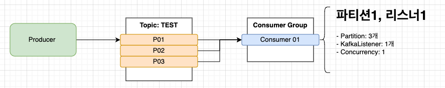
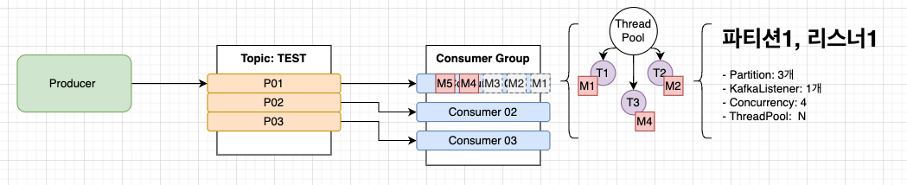

# Kafka Consumer Concurrency 설정 

## 개요

- Kafka는 토픽내에 파티션을 두어 병렬 처리를 수행할 수 있도록 한다. 
- 이때 파티션의 개수에 따라 컨슈머가 어떻게 연동되는지 이해할 필요가 있으며, 또한 이를 위해서 메시지를 Concurrency 로 처리하기 위한 방안을 이해하고 있어야한다. 

## 단일파티션 단일 컨슈머


- 토픽이름: TEST
- 파티션 개수: 1개
- KafkaListener: 1개
- Concurrency: 1

> 위와 같은 설정을 수행하면 컨슈머는 매번 1개의 메시지만 처리하게 된다. 
> 이 경우 컨슈머는 직렬로 메시지를 처리하는 형태이므로 처리속도가 가장 느리다. 

### Sample

```java
    @KafkaListener(id = "TestConsumerGroup", topics = {"test"}, concurrency = "1")
    public void ListenTest(String message
            , @Header(KafkaHeaders.RECEIVED_PARTITION_ID) List partitions
            , @Header(KafkaHeaders.RECEIVED_TOPIC) List topics
            , @Header(KafkaHeaders.OFFSET) List offsets) {
        log.info("<<< topics.get(0)={}, partitions.get(0)={}, offsets.get(0)={}, jsonMessage={}", topics.get(0), partitions.get(0), offsets.get(0), message);
    }
```

## 파티션 3개, 컨슈머 1개



- 토픽이름: TEST
- 파티션 개수: 3개
- KafkaListener: 1개
- Concurrency: 1

> 파티션이 3개이고, 컨슈머가 1개라면 파티션이 1개일때와 처리방식이 동일하다. 
> 그리고 처리속도역시 가장 느린 상황이 된다. 

## 파티션 3개, 컨슈머 3개


- 토픽이름: TEST
- 파티션 개수: 3개
- KafkaListener: 1개
- Concurrency: 3

> 파티션이 3개이고, 컨슈머가 3개 (concurrency가 3) 인 경우이다. 
> 파티션 1, 컨슈머 1 상황에 비해 3배 빠른 속도로 메시지를 처리하게 된다. 

### Sample

```java
    @KafkaListener(id = "TestConsumerGroup", topics = {"test"}, concurrency = "3")
    public void ListenTest(String message
            , @Header(KafkaHeaders.RECEIVED_PARTITION_ID) List partitions
            , @Header(KafkaHeaders.RECEIVED_TOPIC) List topics
            , @Header(KafkaHeaders.OFFSET) List offsets) {
        log.info("<<< topics.get(0)={}, partitions.get(0)={}, offsets.get(0)={}, jsonMessage={}", topics.get(0), partitions.get(0), offsets.get(0), message);
    }
```

## 파티션 3개, 컨슈머 4개


- 토픽이름: TEST
- 파티션 개수: 3개
- KafkaListener: 1개
- Concurrency: 4

> 파티션 개수가 3개이고, 컨슈머가 파티션개수보다 높은 4개라면 오직 3개의 컨슈머만 파티션에 할당된다. 
> 그러므로 결국 4번재 컨슈머는 아무일도 하지 않게 된다. 
> 성능은 파티션 3개, 컨슈머 3개와 동일한 속도로 메시지를 처리한다. 

### Sample

```java
    @KafkaListener(id = "TestConsumerGroup", topics = {"test"}, concurrency = "4")
    public void ListenTest(String message
            , @Header(KafkaHeaders.RECEIVED_PARTITION_ID) List partitions
            , @Header(KafkaHeaders.RECEIVED_TOPIC) List topics
            , @Header(KafkaHeaders.OFFSET) List offsets) {
        log.info("<<< topics.get(0)={}, partitions.get(0)={}, offsets.get(0)={}, jsonMessage={}", topics.get(0), partitions.get(0), offsets.get(0), message);
    }
```

## 파티션 3개, 컨슈머 3개, 멀티쓰레드 



- 토픽이름: TEST
- 파티션 개수: 3개
- KafkaListener: 1개
- Concurrency: 3
- ThreadPoolExecutor: 풀 크기 3

> 각 컨슈머는 파티션이 1개씩 할당이 된다. 
> 메시지를 처리할때 ThreadPool에서 Thread를 꺼내서 실행하고, 컨슈머를 종료시킨다. 
> 이경우 메시지 처리가 ThreadPool에서 할당받을수 있는 쓰레드 크기만큼 메시지 처리를 병렬로 수행한다. 
> 중요: 이때에는 파티션에 들어온 메시지 순서가 더이상 보장되지 않는다 (사용할때 순서가 중요하다면 사용불가하다.)

### Sample

```java
    ExecutorService kafkaExecutor = Executors.newFixedThreadPool(30);

    @KafkaListener(id = "TestConsumerGroup", topics = {"test"}, concurrency = "3")
    public void ListenTest(String message
            , @Header(KafkaHeaders.RECEIVED_PARTITION_ID) List partitions
            , @Header(KafkaHeaders.RECEIVED_TOPIC) List topics
            , @Header(KafkaHeaders.OFFSET) List offsets) {
        log.info("<<< topics.get(0)={}, partitions.get(0)={}, offsets.get(0)={}, jsonMessage={}", topics.get(0), partitions.get(0), offsets.get(0), message);
        kafkaExecutor.execute(() -> consumerService.receivedMessage((String)topics.get(0), (Integer)partitions.get(0), message));
    }
```