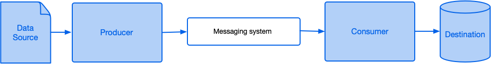
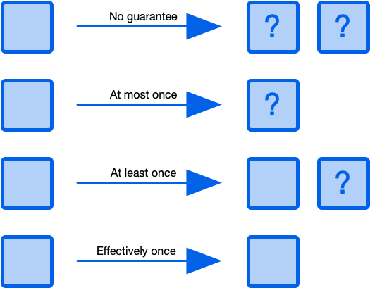
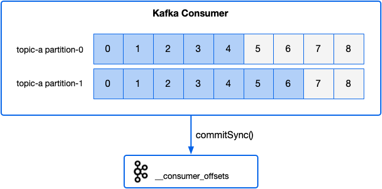
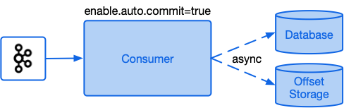
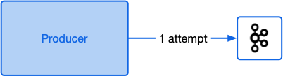
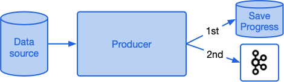
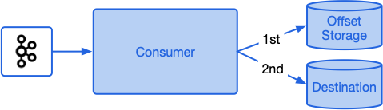
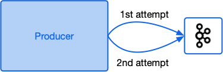
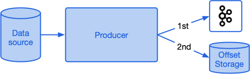
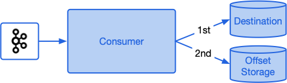

# Processing guarantees in Kafka

from: https://medium.com/@andy.bryant/processing-guarantees-in-kafka-12dd2e30be0e

- AWS SQS, AWS Kinesis, Apache Kafka  등을 설계할때 항상 고려해야할 사항
  - 모든 메시지가 처리된다는 것을 어떻게 보장하는가?
  - 중복 메시지를 피하거나 처리하는 방법은 무었인가?

- 이러한 질문에 대한 답변은 매우 어렵다. 이를 위해서는 Producer, Consumer 가 분산 메시징 시스템과 상호작용하는 방법을 탐구해야한다. 
- 여기서는 메시지 처리 보장과 분산메시지 시스템을 중심으로 시스템을 설계하고 구축할 때 갖는 의미를 살펴볼 것이다. 

- 기본적인 아키텍처 (분산 메시징 시스템)

- 프로듀서는 소스에서 읽은 다음 네트워크를 통해 메시징 시스템에 쓴다. 
- 메시징 시스템은 일반적으로 중복성을 위해 여러 위치에 메시지를 유지한다. 
- 하나 이상의 컨슈머가 네트워크를 통해 메시징 시스템을 폴링하고, 새 메시지가 배치 처리를 수신하고, 이러한 메시지에 대해 일부 작업을 수행하며, 종종 데이터를 변환하고, 다른 원격 데이터 저장소에 기록한다. 
- 이 기본 디자인은 Apache Kafka, Apache Pulsar, AWS Kinesis, AWS SQS, Google Cloud Pub/Sub 그리고 Azure Event Hubs 에 적용된다. 

 

- 만약 이 시스템에 대한 설명서를 읽으면 메시지 처리 보장의 개념을 상당히 빨르게 알게 될 것이다. 
- 범주는 다음과 같다. 
  - No guarantee(보장 없음): 명시적인 보장이 제공되지 않는다. 그래서 컨슈머들은 메시지를 한번, 여러 번 또는 전혀 처리하지 않을 수 있다. 
  - At most once(최대 1번): 최선의 노력으로 전달한다는 의미이다. 컨슈머들은 메시지를 정확히 한번만 수신하고 처리하거나 혹은 전혀 처리하지 않는다. 
  - At least once(최소 1번): 소비자는 모든 메시지를 수신하고 처리하지만 동일한 메시지를 두번 이상 처리할 수 있다. 
  - Effectively once(정확히 1번): 정확히 한번 이라고도 하는 이것은 모든 메시지를 한 번만 처리할 것이라고 약속한다. 

- 이 시점에서 왜 이렇게 혼란스러운지 물어볼 것이다. 
- 왜 이 한번이라는 것이 항상 효율적으로 동작하지 않는가?
- 메시지가 누락되거나, 두 번 이상 나타나는 원인은 무엇인가?
- 다음은 고려해야할 실패 시나리오의 작은 집합이다 .
  - 프로듀서 실패
  - 컨슈머 퍼블리시 원격 호출 실패
  - 메시징 시스템 실패
  - 컨슈머 처리 실패

- 소비자 프로세스는 다운스트림 데이터베이스에 쓰는 동안 메모리가 부족하고 깨질 수 있다.
- 브로커의 디스크가 부족할 수 있다. 
- ZooKeeper 인스턴스 간에 네트워크 분절이 있을 수 있다. 
- 카프카에 메시지 게시 시간 초과가 발생할 수 있다. 
- 이러한 유형의 실패는 단지 가설이 아니다. 
- 프로덕션을 포함한 모든 환경의 중요하지 않은 시스템에서 발생할 수 있다. 
- 이러한 오류를 처리하는 방법에 따라 시스템 전체의 처리에 대한 보장이 결정된다. 

- 다양한 유형의 보장에 대해 자세히 살펴보기 전에 카프카 컨슈머 API를 살펴볼 것이다. 이는 아래 많은 예제와 관련이 있다. 

## Kafka Consumer API

- 프로세스는 소비자 API를 사용하여 Kafka 에서 데이터를 가져온다. 
- 컨슈머를 생성할때 클라이언트는 소비자 그룹을 지정할 수 있다. 
- 이것은 토픽 파티션 세트에서 데이터를 읽도록 조정하는 소비자 컬렉션을 식별한다. 
- 소비자 그룹의 소비자가 구독하는 주제의 파티션은 언제든지 해당 그룹의 최대 하나의 개별 소비자에게 할상되도록 보장한다.
- 각 토픽 파티션의 메시지는 로그에 저장된 순서대로 할당된 소비자에게 엄격하게 전달된다. 
- Kafka 에서 데이터 읽기 진행 상황을 저장하려면, 컨슈머가 할당된 각 토픽 파티션에서 읽을 다음 메시지의 오프셋을 저장해야한다. 
- 컨슈머는 원하는 곳에 오프셋을 자유롭게 저장할 수 있지만, 기본적으로 모든 Kafka Streams 응용 프로그램의 경우 이러한 오프셋은 _consumer_offset 이라는 내부 카프카 자체에 다시 저장된다. 
- 이 메커니즘을 사용하려면 소비자가 구성 플래그 enable.auto.commit 을 true로 설정하거나 오프셋 커밋을 명시적으로 호출하여 Kafka로 오프셋을 자동으로 주기적 커밋을 할 수 있다. 
- 아래 예에서 소비자는 topic-a 파티션 0에 대해서 오프셋 5를 저장하고 topic-a 파티션 1에 대해 오프셋 7을 저장한다. 

- 이제 guarantees 에 대해서 자세히 살펴 보자. 

### No guarantee (보장 없음)

- no guarantee 시스템은 주어진 메시지가 한번, 여러 번 또는 전혀 처리되지 않을 수 있음을 의미한다. 
- Kafka 를 사용하면 enable.auto.commit 을 true로 설정된 소비자가 있고 각 메시지 배치에 대해 비동기식으로 처리하고 결과를 데이터베이스에 저장하는 경우이다. 

- auto commit 가 enabled 되면, 컨슈머는 후속 폴링이 시작될때 주기적으로 오프셋을 Kafka에 다시 저장한다. 
- 이러한 커밋의 빈도는 파라미터 auto.commit.interval.ms 를 통해 설정할 수 있다. 
- 만약 메시지를 데이터베이스에 저장한다면, 진행율이 저장되기 전에 응용프로그램이 깨지는 경우 다음 실행에서 해당 메시지를 다시 실행하고, 데이터베이스에 두번 저장되는 현상이 생긴다. 
- 만약 처리가 저장되고 결과가 데이터베이스에 저장되기 전에 프로그램이 깨지면 이 메시지는 다음 처리에서 실행되지 않을 것이고, 메시지는 유실된다. 

### At most once (최대한 한번)

- at most once (최대 1번) 보장은 메시지가 정확히 한번 실행되거나 혹은 한번도 실행되지 않을 수 있다. 
- 이 보장은 종종 best effort 라고 알려져 있다. 

1. at most once에 대한 일반적인 예는 프로듀서가 fire-and-forget 접근 방법으로 kafka에 메시지를 보내고, 재실행 하지 않는다. 그리고 브로커로 부터 오는 어떠한 응답도 무시하게 된다. 이 접근은 진행 상황이 완성도 보다 우선 순위가 더 높은 경우 유용하다. 

2. 프로듀서는 소스 시스템으로 부터 읽기 처리를 저장한다. 그리고 데이터를 kafka에 쓰기한다. 만약 프로듀서가 두번째 스텝에서 깨지게 되면 데이터는 kafka에 전달되지 않는다. 

3. 컨슈머는 메시지를 kafka로 부터 수신 받는다. 이를 변환하고, 결과를 데이터베이스에 저장된다. 컨슈머 어플리케이션은 enable.auto.commit 을 false로 할당하고, 데이터베이스에 쓰기전에 오프셋을 kafka에 다시 커밋하도록 프로그램되어 있다. 만약 컨슈머가 offset을 kafka에 저장한 이후에 실패하지만 데이터를 데이터베이스에 저장하기 전에 수행되었다면 이는 다음번 수행할때 이 메시지는 유실된다. 

### At least once (최소한 한번)

- at least once 보장은 모든 메시지를 확실히 수신하고 처리한다는 것을 의미하지만 실패에 직면하여 일부 메시지를 추가로 처리할 수 있다. 
- 여기에 몇가지 실패에 대한 예제는 최소 한 번 의미로 수행될 수 있다.

1. 어플리케이션은 메시지의 배치를 Kafka에 전달한다. 어플리케이션 배치전송에 대한 응답을 결과를 받지 않으므로 배치를 다시 전송하게 된다. 이 경우 첫 번째 배치가 성공적으로 저장되었을 수 있지만 승인이 유실하면, 결국 메시지가 두번 추가된다. 

2. 어플리케이션이 이벤트를 포함하는 대용량 파일을 처리한다. 이는 메시지를 kafka에 보내는 처리를 수행한다. 파일 처리중 프로세스가 종료되고 다시 시작된다. 그리고 처음부터 파일을 다시 시작하고, 전체 파일을 읽은 경우에만 처리된 것으로 표시한다. 이 상황에서 파일의 처음 절반에 해당하는 이벤트는 kafka에 두번 존재한다. 

3. 컨슈머는 Kafka로 부터 메시지의 배치를 수신받고, 변환하고, 데이터베이스에 쓰기를 한다. 컨슈머 어플리케이션은 enable.auto.commit 를 false로 설정하고, 데이터베이스에 쓰기가 완료되면 오프셋을 커밋하게 된다. 만약 컨슈머가 Kafka에 오프셋을 저장하기 전이고, 데이터베이스에 쓰기를 완료한 이후에 어플리케이션이 실패하면, 동일한 레코드가 다음번에도 다시 실행된다. 그리고 데이터베이스에 헌번더 씌여지게 된다. 

### Effectively once

- Pulsar 및 Prevega와 같은 많은 분산 메시징 시스템과 Kafka Streams, Spark, Flink, Delta Lake 및 Cloud Dataflow와 같은 데이터 처리 시스템은 특정 시나리오에서 정확히 한 번 또는 유효 한 번 의미 체계를 주장한다. 
- 2017년 Confluent는 Apache Kafka 0.11에서 Exactly Once 구문을 도입했다. 
- exactly-once 를 달성하는 것에서 effectively-once 는 다양한 방법과 이를 위한 실제 테스팅 등을 수행하며, 멱등성 혹은 트랜잭션 등으로 수행된다. 
- 우선 이 두가지 기능을 살펴보고 효과적으로 한번 지원한 데 필요한 사유에 대해서 알아보자. 

### Idempotent write (멱등성 쓰기)

- 위서 다룬 프로듀서의 케이스중 at least once 보장 시나리오의 하나는, 이전 프로듀스 호출이 성공했는지 확인할 수 없기 때문에 메시지 배치를 다시 보내게 된다. 
- 이전 버젼의 kafka에서 브로커는 두번째 배치가 이전 배치의 재시도인지 판별할 수단이 없었다. 
- kafka 0.11 이후 부터 생산자는 구성 플래그에서 enable.idempotence를 true로 설정하여 멱등 쓰기를 선택할 수 있다. (기본적으로 비활성화되어 있음)
- 이로 인해서 클라이언트는 브로커에게 생산자 ID(pid) 를 요청한다. 
- pid는 kafka가 생상자를 식별하는데 도움이 된다. 멱등성이 활성화 되면 생산자는 레코드의 각 배치와 함께 시퀀스 번호와 함께 pid를 보내게 된다. 
- 시퀀스 번호는 논리적으로 동일한 프로듀서에 의해서 전송된 각 레코드의 하나마다 증가된다. 
- 배치 레코드 수와 함께 배치에 있는 첫 번째 레코드의 시퀀스 번호가 주어지면 브로커는 배치에 대한 모든 시퀀스 번호를 파악할 수 있다. 
- 멱등성을 활성화 하면 브로커는 레코드의 새로운 배치를 수신받는다. 만약 시퀀스 번호가 이미 커밋되어 있다면 배치는 재시도로 처리되고 무시된다. (중복 승인이 클라이언트로 다시 전송된다.)

- 만약 멱등성 쓰기가 kafka 0.11에 처음 나왔을때 브로커는 동일한 생산자의 메시지 순서를 보장하기 위해 생산자당 한번에 하나의 실행중인 일괄 처리만 처리할 수 있었다. 
- kafka 1.0.0 에서는 동일한 생산자로 부터 최대 5개의 동시 요청 (max.in.flight.requests.per.connection=5)이 있는 멱등성 쓰기가 지원된다. 
- 이 의미는 5개의 실행중인 요청을 가질 수 있고, 올바른 순서로 로그에 기록된다. 
- 이는 일괄 재시도 또는 kafka 파티션 리더 변경이 있는 경우에도 작동한다. 이러한 경우 클러스터가 자동으로 재 정렬할 것이기 때문이다. 

### Transactions

- 